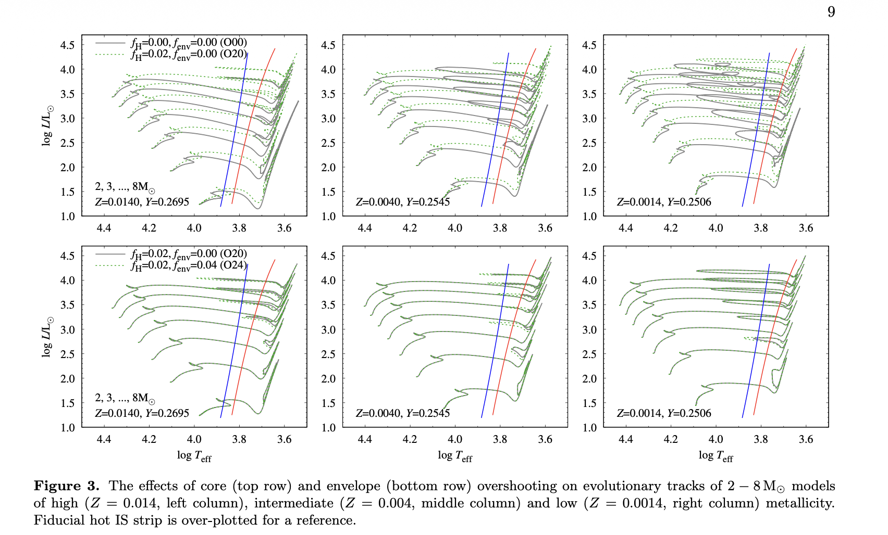
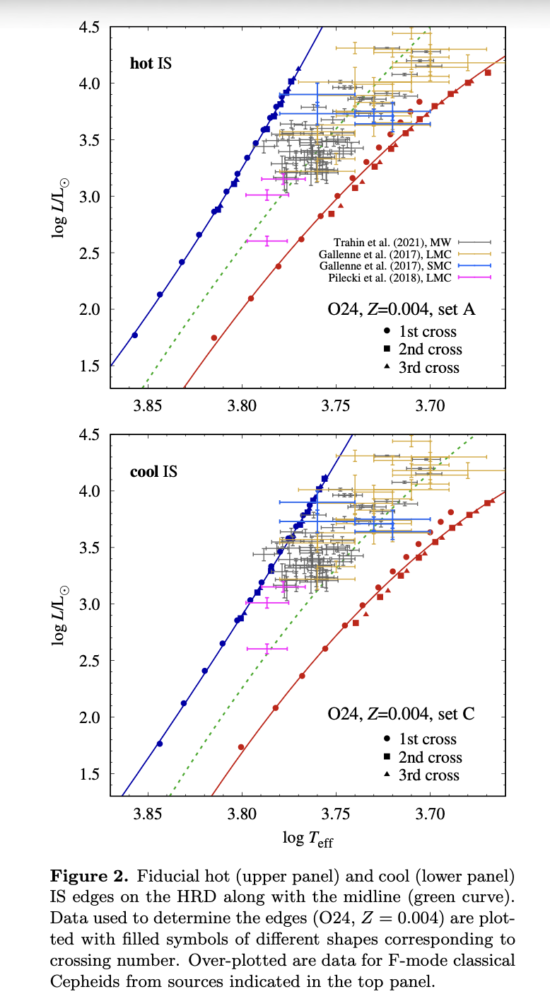
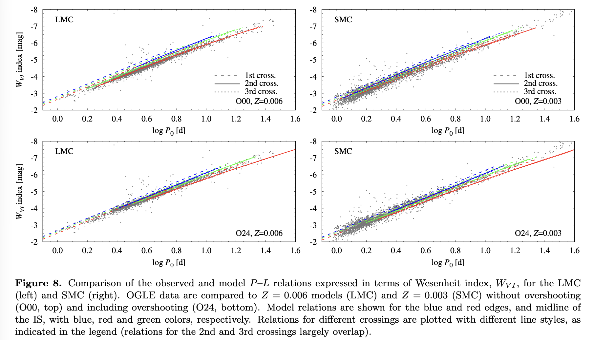
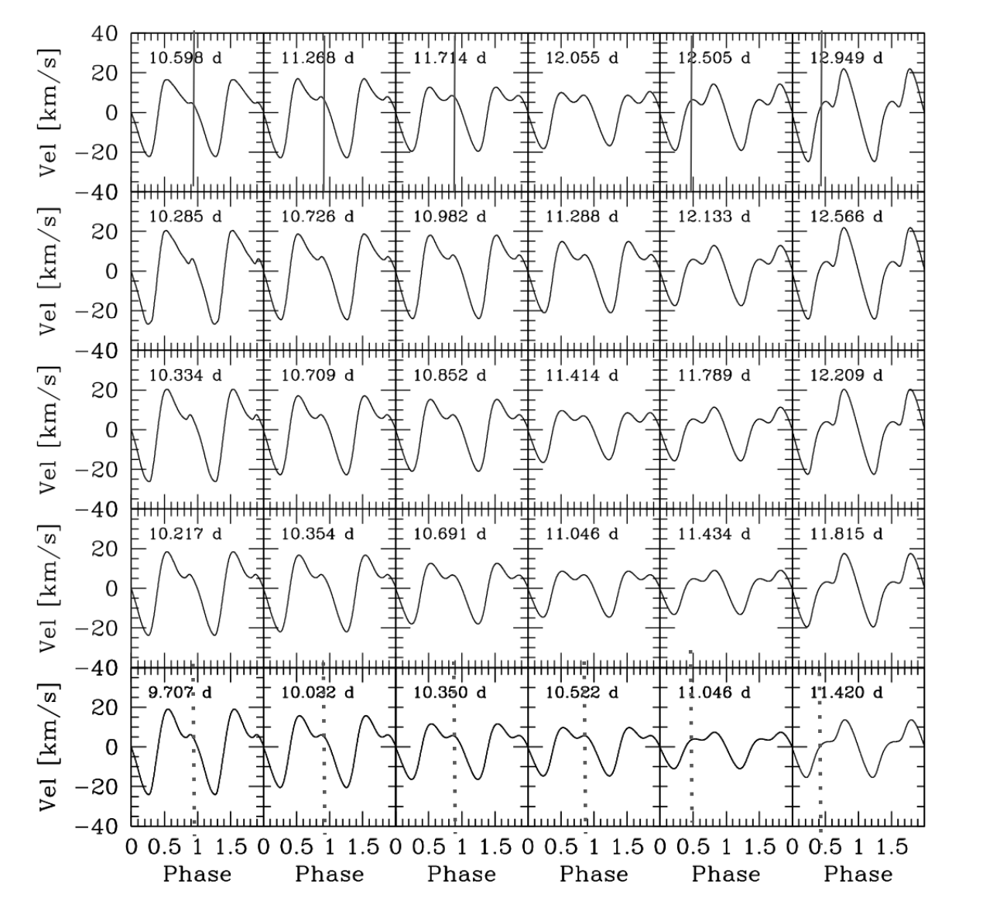

# Classical Cepheid Pulsations in MESA-star

Friday is built around classical Cepheids in the $3$-$8\,M_\odot$ range.

- Lab 1 evolves Cepheid models through helium burning, runs GYRE in MESA, and saves `.mod` files.
- Lab 2 reuses those models, compares GYRE-in-MESA against RSP-LNA for the fundamental radial mode, and builds a `log P` versus `log L` relation.
- Lab 3 uses a small number of nonlinear models to look at bump Cepheids and the Hertzsprung progression.

## Lab 1 - Evolving a Cepheid into the Instability Strip

**Directory:** `lab1_work_dir/`

**Goal**

Evolve classical Cepheid models into core helium burning, identify when they enter the instability strip, run GYRE in MESA during that phase, and save `.mod` files for Lab 2.

**Blue loops and strip crossing**

Source: Figure 3 in [Smolec et al. 2026, MESA Cepheid grid III](https://arxiv.org/abs/2603.26111). This shows an example set of Cepheid models undergoing blue loops and crossing the instability strip during core helium burning, which is exactly the Lab 1 goal.

**What happens**

1. Each table gets a mass in the $3$-$8\,M_\odot$ range, ideally in $0.5\,M_\odot$ steps.
2. Each table evolves its model with the Lab 1 MESA-star setup.
3. During helium burning, the modified `run_star_extras` runs GYRE in MESA and writes mode information.
4. `.mod` files are saved during the Cepheid phase.
5. The class compares which masses cross the strip and which saved models are best for Lab 2.

**Class products**

- an HR diagram with the strip-crossing models marked
- a table with mass, `log L`, `log T_eff`, and saved `.mod` files
- a shared set of helium-burning models for Lab 2

**Reading**

Evolution and blue loops:

- [Ziółkowska et al. 2024, MESA Cepheid grid I](https://ui.adsabs.harvard.edu/abs/2024ApJS..274...30Z/abstract)

Optional background on grid assumptions:

- [Ziółkowska et al. 2026, MESA Cepheid grid II](https://arxiv.org/abs/2602.08109)

## Lab 2 - Linear Analysis in GYRE vs LNA (from RSP)

**Directories**

- `lab1_work_dir/`
- `content/friday/MESA_models/lab2_GYRE_vs_LNA_P_L/rsp_Cepheid_LNA/`

**Goal**

Take the `.mod` files from Lab 1, compare the fundamental radial `l = 0` mode, `P0`, from GYRE-in-MESA against RSP-LNA, and use that comparison to see where the two linear analyses agree and where they do not before building a class period-luminosity relation.

**Observed Cepheids inside the instability strip**

Source: Figure 2 in [Smolec et al. 2026, MESA Cepheid grid III](https://arxiv.org/abs/2603.26111). This figure shows how observed classical Cepheids fall inside the instability strip in the HR diagram. It also shows that the inferred strip edges move with some of the physical assumptions in the convection treatment, although that is a side point here.

**Period-luminosity and Wesenheit relation**

Source: Figure 8 in [Smolec et al. 2026, MESA Cepheid grid III](https://arxiv.org/abs/2603.26111). This is the kind of period-luminosity comparison we want the class to build from the Lab 1 and Lab 2 model outputs.

$$
W_{VI} = I - R_{VI}(V-I)
$$

The Wesenheit relation is a reddening-reduced version of a period-luminosity-color relation, where the color information is folded in by combining `V` and `I` instead of using luminosity alone. We do not need to use the Wesenheit relation for the lab. A simple $\log L$ versus $\log P$ plot is enough. In fact, the scatter in that simpler plot is useful, because part of it comes from the color dependence that the Wesenheit construction is designed to reduce.

Another Lab 2 point is why GYRE and RSP-LNA do not agree perfectly. In the non-adiabatic calculation, GYRE uses the frozen convection approximation and drops the perturbation to convective flux. That makes it behave more like a radiative linear calculation. For Cepheids, periods can still agree fairly well, but growth rates often do not, especially once convection matters more. So we expect the best agreement near the blue edge and the worst agreement near the red edge, and the class should check that directly.

**What happens**

1. Start from the saved `.mod` files from Lab 1.
2. Pull out the fundamental radial `l = 0` mode information, `P0`, from the GYRE-in-MESA output first.
3. Use the `rsp_Cepheid_LNA` directory to run RSP-LNA on the same stellar structures.
4. Compare the two calculations for both period and growth rate, starting with the fundamental mode.
5. Put the class results into Google Sheets and build a `log P` versus `log L` plot.
6. If there is time, use the colors module as an extra step and build a Wesenheit-based relation.
7. If there is time, inspect any unstable radial overtone `l = 0` cases that appear in the output, such as `P1` or `P2`.

**Class products**

- a table of GYRE-in-MESA and RSP-LNA periods and growth rates for the fundamental `l = 0` mode, `P0`
- a class `log P` versus `log L` relation
- an optional Wesenheit relation
- an optional short list of unstable radial overtone cases

**Reading**

Method references:

- [Townsend and Teitler 2013, GYRE](https://ui.adsabs.harvard.edu/abs/2013MNRAS.435.3406T/abstract)
- [Paxton et al. 2019, MESA V](https://ui.adsabs.harvard.edu/abs/2019ApJS..243...10P/abstract)
- [Anderson et al. 2016, pulsation-convection coupling and Cepheid instability-strip edges](https://www.aanda.org/articles/aa/full_html/2016/07/aa28031-15/aa28031-15.html)

Pulsation and P-L references:

- [Smolec et al. 2026, MESA Cepheid grid III](https://arxiv.org/abs/2603.26111)
- [Bono et al. 1999, theoretical Cepheid P-L, P-C, and P-L-C relations](https://ui.adsabs.harvard.edu/abs/1999ApJ...512..711B/abstract)
- [Espinoza-Arancibia et al. 2022, period change rates of LMC Cepheids using MESA](https://ui.adsabs.harvard.edu/abs/2022MNRAS.517.1538E/abstract)

Observational context:

- [Riess et al. 2022](https://ui.adsabs.harvard.edu/abs/2022ApJ...934L...7R/abstract)
- [Riess et al. 2024](https://ui.adsabs.harvard.edu/abs/2024ApJ...977..120R/abstract)

## Lab 3 - The Hertzsprung Progression

**Directory:** `content/friday/MESA_models/lab3_Hertzsprung_progression/TDC_Cepheid/`

**Goal**

Run a few nonlinear fundamental mode Cepheid models and use them to study bump Cepheids and the Hertzsprung progression.

**Bump morphology across the Hertzsprung progression**

Source: Figure 4 in [Marconi et al. 2024, The Hertzsprung progression of classical Cepheids in the Gaia era](https://ui.adsabs.harvard.edu/abs/2024MNRAS.529.4210M/abstract). This shows the bump shifting across the radial velocity curve as period changes.

The usual interpretation is that this morphology is tied to a near `2:1` resonance between the second overtone and the fundamental mode, so the key quantity is $P_2/P_0 \approx 0.5$. As the stellar structure changes, the resonance condition shifts and the bump moves from the descending branch, through the middle, and onto the rising branch. That is why we focus first on fundamental mode Cepheids.

Cepheids are part of the distance ladder, and the most distant Cepheid data are often sparse and noisy enough that template fitting does a lot of the work. In the bump-Cepheid period range, it is not always clear whether those analyses are fitting the bump itself or smoothing across it, but either way the morphology may matter for the inferred mean magnitudes. So this is also tied to distance work by Riess and collaborators and related Cepheid analyses.

**What happens**

1. Start from one or two fundamental mode Cepheid models prepared in the earlier labs.
2. Use the `TDC_Cepheid` setup to kick the models and evolve them to finite amplitude.
3. Inspect the light, radius, and velocity curves.
4. Record where the bump appears: descending branch, middle, or rising branch.
5. Collect the class results in Google Sheets and reconstruct the bump progression.
6. If there is time, note any unstable radial overtone `l = 0` cases that appear, such as `P1` or `P2`, and compare them against the fundamental mode sequence.

**Class products**

- a small set of nonlinear Cepheid light curves
- a class sheet marking the bump location for each model
- a bump-progression sequence
- an optional note on any unstable radial overtone outliers

**Reading**

- [Farag et al. 2026, self-consistent nonlinear classical Cepheid pulsations during stellar evolution with MESA](https://arxiv.org/abs/2603.15766)
- [Bono, Marconi, and Stellingwerf 2000, the Hertzsprung progression](https://ui.adsabs.harvard.edu/abs/2000A%26A...360..245B/abstract)
- [Marconi et al. 2024, the Hertzsprung progression of classical Cepheids in the Gaia era](https://ui.adsabs.harvard.edu/abs/2024MNRAS.529.4210M/abstract)
- [Simon and Schmidt 1976](https://ui.adsabs.harvard.edu/abs/1976ApJ...205..162S/abstract)
- [Hocdé et al. 2024, Cepheid radial velocity Fourier parameters](https://ui.adsabs.harvard.edu/abs/2024A%26A...689A.224H/abstract)
- [Hocdé et al. 2024, Y Oph with RSP/MESA](https://ui.adsabs.harvard.edu/abs/2024A%26A...683A.233H/abstract)

## Useful Links

- [Radek Smolec 2021, Radial Stellar Pulsations](https://doi.org/10.5281/zenodo.5234608)
- [Radek Smolec 2023, Cepheids and Nuclear Reactions](https://drive.google.com/drive/folders/1YD55CFgj4yegYi-IxaTY5NODXPVLOANO)
- [Joyce Guzik 2019, Adventures with Cepheids](https://doi.org/10.5281/zenodo.3374957)
