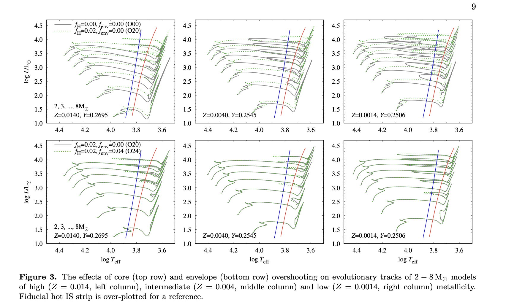
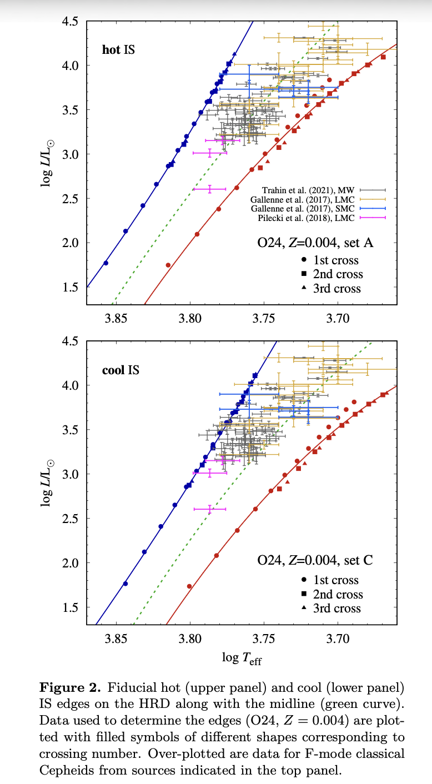
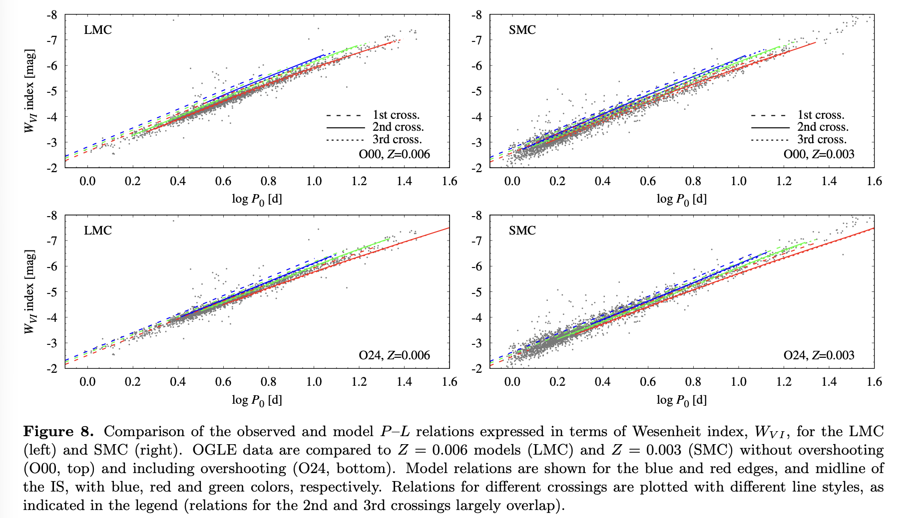
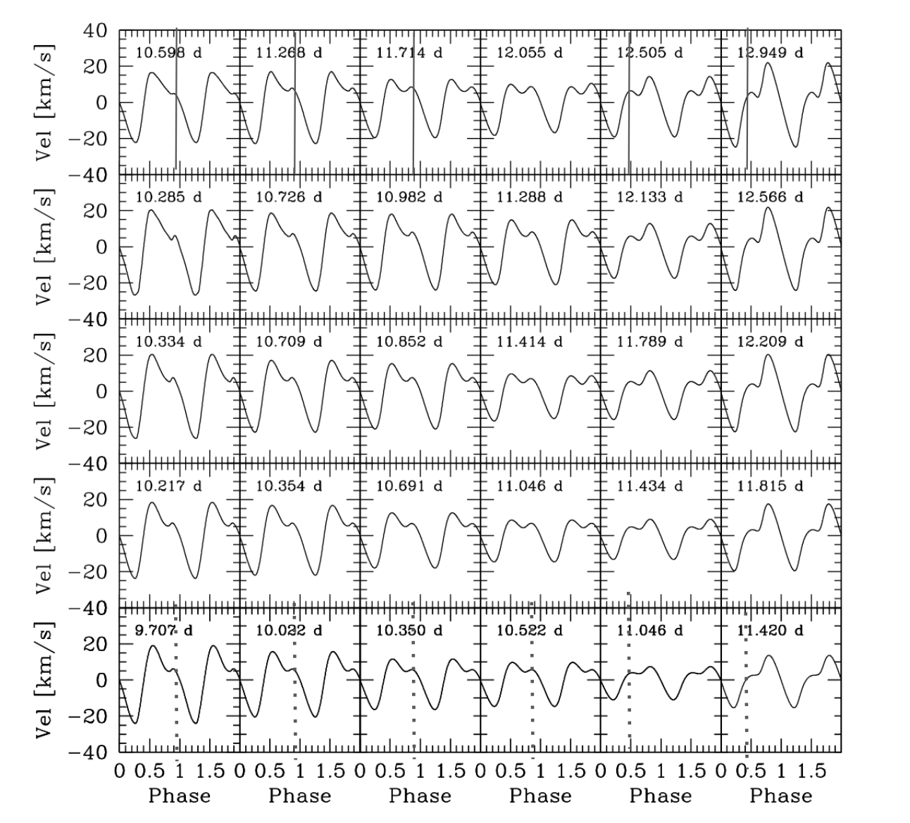

# Classical Cepheid Pulsations in MESA-star

Friday is built around one connected Cepheid workflow. The models are LMC-like, with `Z = 0.006`, `Y = 0.2575`, and initial masses in the $3.9-9.4\,M_\odot$ range.

- Lab 1 evolves the stellar models, runs GYRE inside MESA-star during the Cepheid phase, and saves `.mod` files.
- Lab 2 uses those same saved models to compare GYRE-in-MESA with RSP linear nonadiabatic analysis and to build period-luminosity and period Wesenheit relations.
- Lab 3 uses selected saved models as starting points for nonlinear TDC pulsation runs and reconstructs the Hertzsprung progression.

## Lab 1 - Evolving a Cepheid into the Instability Strip

**Directory:** `lab1_work_dir/`

**Goal**

Evolve a classical Cepheid candidate through the relevant parts of the HR diagram, identify whether it enters the instability strip, run GYRE during the Cepheid phase, and save the models needed by Labs 2 and 3.

**Blue loops and strip crossing**

Source: Figure 3 in [Smolec et al. 2026, MESA Cepheid grid III](https://arxiv.org/abs/2603.26111). The lab models are designed to make clean blue loops through the classical Cepheid instability strip.

**What happens**

1. Choose one initial mass from the shared class grid.
2. Evolve from the ZAMS to the onset of core helium burning using a custom `run_star_extras` stopping condition.
3. Restart with `./re`, switch to an inlist stopping condition, and run to core helium depletion.
4. Fix the GYRE-in-MESA setup in `run_star_extras` so GYRE receives the MESA model through `set_model`.
5. Let GYRE run during the dense-output Cepheid part of the evolution.
6. Save period and growth information for the fundamental, first overtone, and second overtone radial modes.
7. Save `.mod` files in `mod_dir/` for later labs.
8. Add the instability strip to PGSTAR and compare the blue-loop behavior across the class.

**Class products**

- a `history.data` file with GYRE periods and growth rates
- optional compact `gyre_in_mesa.data` solution files
- saved `.mod` files grouped by initial mass
- an HR diagram view of which masses make useful Cepheid candidates

**Reading**

Evolution and blue loops:

- [Ziółkowska et al. 2024, MESA Cepheid grid I](https://ui.adsabs.harvard.edu/abs/2024ApJS..274...30Z/abstract)
- [Ziółkowska et al. 2026, MESA Cepheid grid II](https://arxiv.org/abs/2602.08109)
- [Smolec et al. 2026, MESA Cepheid grid III](https://arxiv.org/abs/2603.26111)

## Lab 2 - Linear Analysis in GYRE vs LNA (from RSP)

**Directory:** `content/friday/MESA_models/lab2_GYRE_vs_LNA_P_L/`

**Goal**

Use the saved Lab 1 models to compare two linear pulsation calculations:

- GYRE-in-MESA, which uses the full MESA stellar structure
- RSP-LNA, which builds a static radial envelope model from the model's mass, luminosity, effective temperature, and composition

The class then uses the resulting periods, growth rates, luminosities, and Wesenheit values to compare period-luminosity and period Wesenheit behavior.

**Observed Cepheids inside the instability strip**

Source: Figure 2 in [Smolec et al. 2026, MESA Cepheid grid III](https://arxiv.org/abs/2603.26111). The strip edges depend on the pulsation and convection treatment, which is part of why Lab 2 compares two linear tools instead of treating one as exact.

**Period-luminosity and Wesenheit relation**

Source: Figure 8 in [Smolec et al. 2026, MESA Cepheid grid III](https://arxiv.org/abs/2603.26111). The Friday lab starts with a simple period-luminosity relation and then uses the RSP color output to build a period Wesenheit relation.

$$
W_{VI} = I - R_{VI}(V-I)
$$

The Wesenheit index folds color information into the vertical axis, so it is closer to the observational Cepheid relation than luminosity alone.

**What happens**

1. Choose a saved Lab 1 model with useful fundamental mode information.
2. Add the GYRE period, growth rate, and luminosity to the shared spreadsheet.
3. Set up the RSP work directory and build an RSP envelope using `RSP_mass`, `RSP_Teff`, `RSP_L`, `RSP_X`, and `RSP_Z`.
4. Use `initial_model_number` for bookkeeping so RSP output can be matched back to the Lab 1 model number.
5. Run RSP-LNA with `RSP_max_num_periods = 0`.
6. Add the RSP fundamental period, growth rate, and Wesenheit value to the same spreadsheet row.
7. Use Table 1 if you need a clean RSP positive fallback for Lab 2.
8. Use Table 2 if you need the selected red edge starting models for Lab 3.
9. Compare the full-grid reference plots for instability classification, period radius, period-luminosity, period Wesenheit, and direct GYRE/RSP period and radius ratios.
10. Optionally automate the RSP-LNA runs with the batch script.

**Class products**

- a GYRE/RSP comparison table for the same saved model numbers
- a class period-luminosity relation
- a class period Wesenheit relation
- a record of which models are useful Lab 2 fallback models
- a selected red edge model list for the Lab 3 nonlinear sample

**Reading**

Method references:

- [Townsend and Teitler 2013, GYRE](https://ui.adsabs.harvard.edu/abs/2013MNRAS.435.3406T/abstract)
- [Paxton et al. 2019, MESA V](https://ui.adsabs.harvard.edu/abs/2019ApJS..243...10P/abstract)
- [Anderson et al. 2016, pulsation-convection coupling and Cepheid instability strip edges](https://www.aanda.org/articles/aa/full_html/2016/07/aa28031-15/aa28031-15.html)

Pulsation and P-L references:

- [Smolec et al. 2026, MESA Cepheid grid III](https://arxiv.org/abs/2603.26111)
- [Bono et al. 1999, theoretical Cepheid P-L, P-C, and P-L-C relations](https://ui.adsabs.harvard.edu/abs/1999ApJ...512..711B/abstract)
- [Espinoza-Arancibia et al. 2022, period change rates of LMC Cepheids using MESA](https://ui.adsabs.harvard.edu/abs/2022MNRAS.517.1538E/abstract)

Observational context:

- [Riess et al. 2022](https://ui.adsabs.harvard.edu/abs/2022ApJ...934L...7R/abstract)
- [Riess et al. 2024](https://ui.adsabs.harvard.edu/abs/2024ApJ...977..120R/abstract)

## Lab 3 - The Hertzsprung Progression

**Directory:** `content/friday/MESA_models/lab3_Hertzsprung_progression/`

**Goal**

Use nonlinear time dependent convection (TDC) runs to see how a finite amplitude Cepheid waveform develops, classify the bump location, and reconstruct the Hertzsprung progression across the class sample.

**Bump morphology across the Hertzsprung progression**

Source: Figure 4 in [Marconi et al. 2024, The Hertzsprung progression of classical Cepheids in the Gaia era](https://ui.adsabs.harvard.edu/abs/2024MNRAS.529.4210M/abstract). The bump shifts across the waveform as period changes.

The usual single mode interpretation is that the morphology is tied to a near `2:1` resonance between the second overtone and the fundamental mode:

$$
P_2/P_0 \approx 0.5.
$$

This is a guide to the clean fundamental mode Hertzsprung progression, not a complete description of every pulsating star. Multiperiodic, mode switching, period doubled, and irregular behavior are part of the broader nonlinear mode selection problem.

**What happens**

1. Start from a saved Lab 1 `.mod` file, preferably one of the Table 2 red edge models from Lab 2.
2. Set `load_model_filename` in `inlist_pulses`.
3. Choose an initial kick for the fundamental radial mode.
4. Compile and run the TDC setup.
5. Watch PGSTAR and the saved outputs until the model develops a coherent finite amplitude pulsation.
6. Use the lab standard, not a full science-run standard: the waveform only needs to be developed enough to classify the bump.
7. Record the nonlinear period and whether the bump is on the descending branch, middle of the cycle, rising branch, or unclear.
8. Compare the class results by period.
9. Optionally compare with Lab 2, make movies, or add a cycle-averaged diagnostic in the bonus coding task.

**Class products**

- a set of nonlinear Cepheid light curves
- a class table with model, period, and bump classification
- a bump-progression sequence
- notes on any models that do not behave as clean single mode pulsators

**Reading**

- [OGLE Atlas of Variable Star Light Curves, classical Cepheids](https://ogle.astrouw.edu.pl/atlas/classical_Cepheids.html)
- [OGLE Atlas of Variable Star Light Curves, Type II Cepheids](https://ogle.astrouw.edu.pl/atlas/type_II_Cepheids.html)
- [Farag et al. 2026, self-consistent nonlinear classical Cepheid pulsations during stellar evolution with MESA](https://arxiv.org/abs/2603.15766)
- [Smolec 2014, mode selection in pulsating stars](https://arxiv.org/abs/1309.5959)
- [Bono, Marconi, and Stellingwerf 2000, the Hertzsprung progression](https://ui.adsabs.harvard.edu/abs/2000A%26A...360..245B/abstract)
- [Marconi et al. 2024, the Hertzsprung progression of classical Cepheids in the Gaia era](https://ui.adsabs.harvard.edu/abs/2024MNRAS.529.4210M/abstract)
- [Simon and Schmidt 1976](https://ui.adsabs.harvard.edu/abs/1976ApJ...205..162S/abstract)
- [Hocde et al. 2024, Cepheid radial velocity Fourier parameters](https://ui.adsabs.harvard.edu/abs/2024A%26A...689A.224H/abstract)
- [Hocde et al. 2024, Y Oph with RSP/MESA](https://ui.adsabs.harvard.edu/abs/2024A%26A...683A.233H/abstract)

## Useful Links

- [Radek Smolec 2021, Radial Stellar Pulsations](https://doi.org/10.5281/zenodo.5234608)
- [Radek Smolec 2023, Cepheids and Nuclear Reactions](https://drive.google.com/drive/folders/1YD55CFgj4yegYi-IxaTY5NODXPVLOANO)
- [Joyce Guzik 2019, Adventures with Cepheids](https://doi.org/10.5281/zenodo.3374957)
