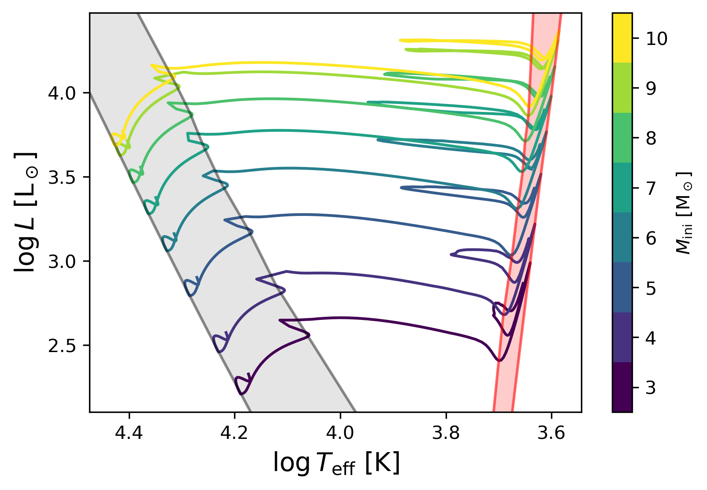
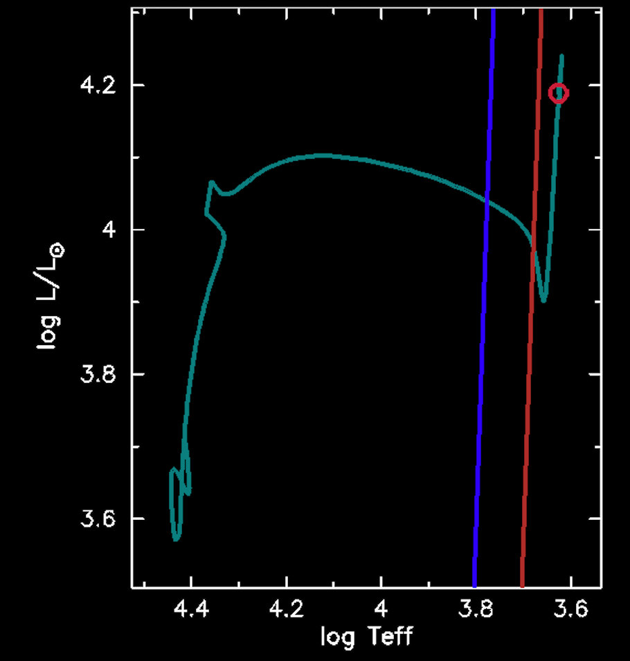
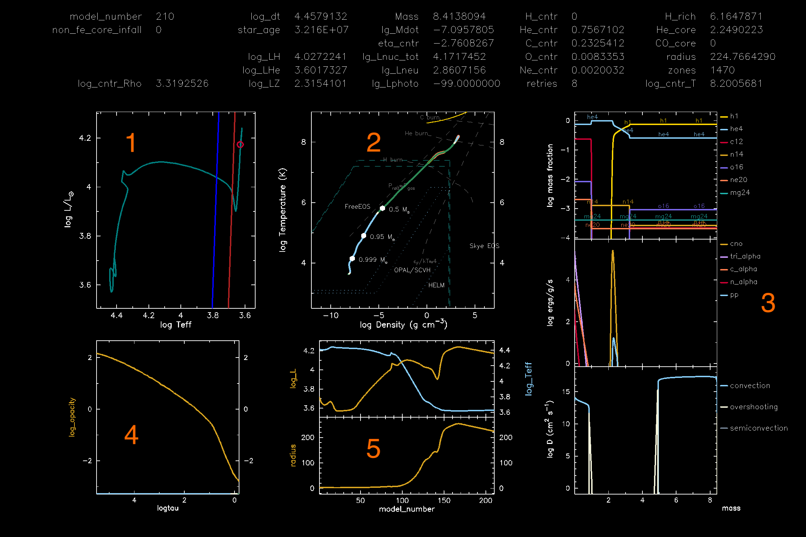

## Summary

In this lab you will learn how to evolve a classical Cepheid model, with an initial mass in the $3.9-9.4\,$M$_\odot$ range. The evolution will be divided in two steps:

1. **Step 1**: you will start from the Zero Age Main Sequence (ZAMS) and stop when a threshold in effective temperature $T_{\mathrm{eff}}$ is reached.

2. **Step 2**: you will resume the previous run and simulate the evolution all the way through He burning, until reaching He depletion in the core.

While the simulation runs in Step 2 you'll get to watch your star experience a blue loop and move through the instability strip, while GYRE runs automatically during the pulsational phase!

During this second part of the run, you will also save some models (called `.mod` files), that will be reused in the next labs.

## 1: Let's get it started in here: setting up the work directory


**Task 1.1**: Download and unzip the initial working directory.

We have already prepared an input directory to get you started with this lab: you can find it [here](https://drive.google.com/file/d/1UxLMBFTgl3q63SNrQwWSEsRIFm6O1v87/view?usp=drive_link).

Download the work directory, move it to your location of choice and unpack it.


<!-- But it's not a Cepheid yet  -->
## 2: Cepheid goes brrr: stopping conditions in ```run_star_extras.f90```

**Task 2.1**: Set the initial mass

Pick an initial mass in the range $3.9-9.4\,$M$_\odot$ from the options available in [this Google Sheet](https://docs.google.com/spreadsheets/d/1dVK0vpzgsAy0S7OG-qMyJlmwItwbp1JeB8B-xScV8WI/edit?usp=sharing). Put your name next to your chosen mass!

> [!IMPORTANT]
> Make sure that each person at your table has chosen a significantly different initial mass value: this will make later comparisons more interesting!

Next, instruct MESA about initial mass you just chose. To do so, open the ```inlist_to_he_dep``` file with your favourite text editor, and find the correct spot to define the initial mass!



You should look for the ```&controls``` namelist in the ```inlist_project``` file, and you will find something like this:

```fortran
   ! set the initial mass here
   initial_mass = 4.5d0
```

Change the value of the ```initial_mass``` variable!


Great, now MESA knows what mass we should _start_ to simulate. However, a MESA run is not complete until we know **when to _stop_**!

**Task 2.2**: Implement a custom stopping condition in ```run_star_extras.f90```.

In this first part of the run, we want to stop the simulation at the base of the Red Giant Branch (RGB). In this case, the most efficient way to do it is to consider a _stopping condition_ based on the **effective temperature** of the star because the RGB is a mostly vertical structure on the Hertzsprung-Russell diagram (HRD), as may be seen on the figure below where the RGB is highlighted in red.



However, in MESA there is **no pre-defined stopping condition that could do it**, so you need to implement it yourself. The best way to do it is create a condition in ```run_star_extras.f90```!

<!-- I recommend letting students think about where to implement this themselves before pointing them to extras_check_model. That might look a little something like this: -->

**Question:** Check the (MESA documentation of ```run_star_extras.f90```)[https://docs.mesastar.org/en/latest/using_mesa/extending_mesa.html]. Where in the control flow does this stopping condition belong?



The function ```extras_check_model``` is called at the end of each solver step, to control if the conditions to stop the evolution are met



<!-- _First thing first_: open the ```run_star_extras.f90``` file and look for the ```extras_check_model``` subroutine. This subroutine will be called at the end of each solver step, to control if the conditions to stop the evolution are met. -->

> [!NOTE]
> Similar functionality is available using the `extras_finish_step` model subroutine. However, that function is only able to return two options: `keep_going` or `terminate`. In addition to these two options, `extras_check_model` can also return `retry` which causes MESA to try again with a smaller time step.

Now we have collected here some important information for you, that might help you with this task:

* From the HRD above, we see that RGB stars have an effective temperature below $10^{3.7}\,$K, so your model should stop at $\log(T_{\mathrm{eff}}) \simeq 3.7 $
* To access the value of $T_{\mathrm{eff}}$ for the current evolutionary step in ```run_star_extras.f90``` file, you need to use a pointer to the stellar structure.

Now try to code up that stopping condition! You can find some useful bits of code below if you need help with that.



```fortran
s% Teff
```

This only works if the pointer ```s``` is already initialized, which is already done by the line
```fortran
type (star_info), pointer :: s
```

<!-- Mathijs: I don't understand what this cautionary note means -->
> [!CAUTION]
> What you get by writing what is in the section above is a _number_,  **not a variable**!






It can be beneficial to save the current $\log{T_\mathrm{eff}}$ in a separate floating-point variable. That makes your code more legible. To do so, add the following at the start of the ```extras_check_model``` function:

```fortran
real(dp) :: logTeff
```






```fortran
log_of_number = safe_log10(number)
```






* In Fortran the '_less than something_' operator can be written as ```.le.```

* The syntax of an ```if``` statement in Fortran is as follows:

```fortran
if (condition_you_want_to_meet) then
    what_happens
endif
```




<!-- * We have already initialized a variable for you called ```logTeff``` in the code that you can use to store the logarithm of the effective temperature
Mathijs: I think it's good practice to let them do that themselves-->


Try and code it yourself, but if you are have some trouble don't hesitate to ask for help or click on the answer below!



Here's how to implement the stopping condition based on the effective temperature of the star:

```fortran
! == TODO: add stopping condition for effective temperature! ==
         logTeff = safe_log10(s% Teff)
         if(logTeff .le. 3.7d0) then
            extras_finish_step = terminate
            write(*, *) '===== you have reached the end of the RGB! ===='
            s% termination_code = t_extras_finish_step
         end if
```


<!-- Mathijs: I made this a collapsible bonus task to not confuse students unnecessarily with the two possible solutions -->


If we wanted to stop more precisely, say when $\log(T_{\mathrm{eff}}) =  3.7 \pm \rm{tol} $ where $\rm{tol}$ is some numeric tolerance, then we could use the following code:

```fortran
! ====== TODO: add stopping condition for effective temperature! ======
         real(dp) :: logTeff, stopping_logTeff, stopping_tol

         logTeff = safe_log10(s% Teff)
         stopping_logTeff = 3.7d0
         stopping_tol = 0.0001d0
         if(logTeff .gt. stopping_logTeff) then
           extras_check_model = keep_going
         else if (abs(logTeff - stopping_logTeff) .lt. stopping_tol) then
           extras_check_model = terminate
           write(*, *) '===== you have reached the end of the RGB! ===='
           s% termination_code = t_extras_check_model
         else ! Avoid overshooting our desired stopping condition using retries
           extras_check_model = retry
         end if
```



To check that everything is working correctly, let's first **compile** the model using

```bash
./clean
./mk
```

If no errors pop up, you are all set! Now run the model using

```bash
./rn
```

During this first run you will see the star evolving through the main sequence and across the Hertzsprung gap to the base of the RGB, and will be the base on which we will be building the second part of the simulation!


## 3. Ah yes, the remix: stopping condition in the ```inlist_to_he_dep```

At this point, the star has reached the base of the RGB. Now we want it to evolve until the end of He burning.
To that end, we need to **choose and implement a different stopping condition**!

**Task 3.1**: Comment or remove the previous stopping condition.

Open ```run_star_extras.f90``` again and look for the stopping condition you just implemented. Once you find it, take extra care in commenting (or deleting) every line that you wrote!

> [!TIP]
> To comment lines in Fortran, simply add a ```!``` at the beginning of the line.

Since you changed ```run_star_extras.f90```, you also need to update the executable. In order to effectively remove the stopping condition based on the temperature from the next part of the evolution, we need to delete the previous ```star``` file from the folder. Now make a new executable file using

```bash
./clean
./mk
```

**Task 3.2**: Setting a new stopping condition.

In this second part of the run, we want to stop the simulation when He is depleted in the core of the star. Luckily, in this case MESA provides a pre-made stopping condition for when the mass fraction of an isotope goes below a user-set value. Can you find it in the documentation?

> [!TIP]
> Have a look at the [`xa_central_lower_limit_species` controls section](https://docs.mesastar.org/en/latest/reference/controls.html#xa-central-lower-limit-species).

> [!TIP]
> Alternatively you can take a look in the ```$MESA_DIR/star/defaults/controls.defaults``` file.

Once you have found the right command, add the stopping condition in your inlist!

In this case, we want to stop the simulation when the core He burning ends, which we'll define as the point where the mass fraction of He in the core falls below ```1d-4```.



Here's how to implement the stopping condition based on the amount of leftover He in the core:

```fortran
   ! == TODO: add a stopping condition here! ==
   ! we want the second part of the run to stop when
   ! the mass fraction of he4 drops below 1d-14
   xa_central_lower_limit_species(1) = 'he4'
   xa_central_lower_limit(1) = 1d-14
```



Amazing! Now you are ready to continue your simulation!
> [!NOTE]
> Since the changes that we made in the ```inlist_project``` are not introducing new code into MESA, we **don't need** to **make a new executable**!

Great, we have the second part of the run set up...but how do we continue without losing what we just computed?
> [!CAUTION]
> Do **not** run the model yet with ```./rn```: this will start a brand new model from the ZAMS!

## 4. Take two: ```./re```

A very powerful feature of MESA is the possibility to restart a simulation from previous steps in the evolution.

This lab is a perfect example of this: we have just run a simulation for a star that has reached the base of the RGB. If we want to evolve it further (like up to He depletion), there is no need to make a new simulation from scratch: **restart** the one you have just stopped!

The way to do it is by using ```photos``` files. These are custom binary files written by MESA, like 'snapshots' taken during the evolution of the star. You can find them in the ```photos/``` directory.

<!-- Mathijs: Good reminder! I like that you add these bits of practical info -->
> [!CAUTION]
> These files are **machine-specific**: so no, you cannot share your photo file with your group mate and expect to obtain the same result!

Now we want to restart our simulation from the last photo MESA took at the end of the previous simulation.

Look into the output from your terminal; you should see something like this

```bash
save photos/x00000384 for model 384
termination code: extras_finish_step
```

> [!NOTE]
> How often a photos are written is set with `photo_interval` in the `controls` section of the inlist. Another important control is `photo_digits` which sets how many digits from the end of the model number are used in the photo name. We set `photo_interval = 8`, so unless we run more than 100,000,000 models, the photo number will always correspond to the model number.

If we want to restart from a specific photo we pass it to the `re` script like this:

```bash
./re x00000384
```

However, if you know you want to start from the most recent photo, you can simply call `./re`.

Another thing to know, restarts can cause your history file to jump around as restarts only append to the existing `history.data` file. That is, if you run a track to model number 500 then restart from model number 300, the original time steps will remain in the history file, which may confuse your later analysis of the history. Another consequence of this is that you cannot change the history column outputs between restarts without causing an error.

> [!CAUTION]
> The method that we have used today (running a model to a stopping condition, then changing `run_star_extras` and starting again from a photo) is fine for exploration runs or debugging things. However, it isn't the most reproducible method, since it's easy to forget what you changed or accidentally restart your run and overwrite the previous results. Since we're not really changing the physics of our models this isn't a problem but if you're doing science runs it's better to use saved `.mod` files and multiple inlists to stop the run and restart with changes.

With all that out of the way go ahead and restart your run from the most recently saved photo.

## 5: Oh no, the run stopped...

A few time steps into your run, the model should crash and leave you with an error message like:

```none
 ABORT at line 280 of /home/lbuchele/mesa-26.04.1/gyre/gyre/src/lib/gyre_mesa_m.fypp
 assertion ASSOCIATED(ml_m) failed with message No model provided"
Note: The following floating-point exceptions are signalling: IEEE_UNDERFLOW_FLAG IEEE_DENORMAL
ERROR STOP

Error termination. Backtrace:
#0  0x75055b22915e in ???
#1  0x75055b229d99 in ???
#2  0x75055b22b155 in ???
#3  0x7e547b in ???
#4  0x408054 in __run_star_extras_MOD_extras_finish_step
	at ../src/run_star_extras.f90:375
#5  0x43d028 in __run_star_support_MOD_after_step_loop
	at ../job/run_star_support.f90:733
#6  0x44021c in __run_star_support_MOD_do_evolve_one_step
	at ../job/run_star_support.f90:176
#7  0x440a95 in __run_star_support_MOD_run1_star
	at ../job/run_star_support.f90:113
#8  0x4093dd in __run_star_MOD_do_run_star
	at /home/lbuchele/mesa-26.04.1//star/job/run_star.f90:44
#9  0x40944a in run
	at ../src/run.f90:13
#10  0x40948c in main
	at ../src/run.f90:2
```

<!-- Mathijs: I worry that this is too much text without any interaction from the students, which may turn them off. Can you think of some way to add some questions, little tasks (like the one about looking up the meaning of the star_get_pulse_data input variables)... in between. For example, make them look up the meanings of x_integer_ctrl(i) in the inlist or something -->
<!-- Mathijs: Also, a flowchart figure that summarises what happens with GYRE in the run_star_extras would be very helpful! -->

Although the first line of the error message points to a file in the MESA source code, the later error message tells us that the error is actually in `run_star_extras` during the `extras_finish_step` routine. To understand how to fix this, we need to look a bit deeper at the provided `run_star_extras` file.

 In previous labs, you used GYRE as a post-processing code on profile files saved by MESA. There is also a way to run GYRE on-the-fly during the evolution, which is what we will use in this lab. In order to use GYRE in this way we have to load the GYRE library with the statement

```fortran
   use gyre_mesa_M
```

at the top of the `run_star_extras` file. We also added a few variables to pass the values returned by GYRE from one `run_star_extras` routine to another. These variables are
```fortran
   real(dp) :: F_period, F_growth, O1_period, O1_growth, O2_period, O2_growth ! GYRE variables to write to history
```
<!-- Mathijs: I think it helps to show what these variables are so the students see what you're talking about and will think about how they might show up again later -->
The next necessary step is to set up GYRE in the `extras_startup` routine. <!-- No matter what you are using GYRE for, these two steps are always necessary! -->
These two steps are always mandatory when using GYRE within MESA.

Scrolling down further to the `data_for_extra_history_columns` routine, you should see that here that we just pass each of the columns we want to save using the variables defined at the start of the file. However, these values are not calculated here. Instead, we calculate them in the `extras_finish_step` function.

After the usual variable declarations and getting the `star_info` data structure, there is a logical called `call_gyre` that is initially set to `.false.`. This structure is useful if you don't want to call GYRE on every single step which can significantly increase the run time of a given evolutionary track (depending on what kind of star you're modelling).

We then have a few lines of code which use the `x_integer_ctrl(1:3)` parameters to set other variables. This renaming isn't strictly necessary, but it makes the code more legible. We then zero out the variables that we saw used in `data_for_extra_history_columns`. As you saw we are only calling GYRE every `s% x_integer_ctrl(1)` time steps, so if we left these variables undefined the time steps during which we don't call GYRE would just keep their values from the previous time step. This can be a bit confusing so by setting everything to zero we ensure that the time steps where GYRE is actually called are clear.
<!-- Mathijs: I don't understand this last sentence -->

The code then checks if we need to call GYRE during this time step. If we do, some additional set-up is required before calling GYRE. First, we need to get the stellar structure data that will be passed to the GYRE pulsation code. This is accomplished with the `star_get_pulse_data` subroutine. This routine has three logical input parameters, take a moment to search the code base and try to figure out what each parameter controls.

> [!TIP]
> To find the source code, you can use `shmesa grep star_get_pulse_data`. This searches all the MESA source code regardless of whether you are in `$MESA_DIR`.



As we want to find where the routine is defined we can ignore any line that begins with `call` or is in a print statement. After running `shmesa grep star_get_pulse_data` in terminal, you should see a line like
```none
$MESA_DIR/star/public/star_lib.f90: star_get_pulse_data => get_pulse_data, &
```

In this file, we find that this function points to another function in the `pulse` module called `get_pulse_data`. Using another `shmesa grep` call we can see that this function is defined in `$MESA_DIR/star/private/pulse.f90` and by examining this file find that the three logical variables correspond to `add_center_point`, `keep_surface_point`, and `add_atmosphere`. We'll keep them set to `.false.` for now.



After getting the pulse data, we now need to put it into a form that GYRE can handle. Take a look at `$MESA_DIR/gyre/public/gyre_mesa_m.f90` to see if you can figure out the correct subroutine to call.

> [!TIP]
> You might want to take another look at the `star_get_pulse_data` call. We've named some variables the same as are used in the GYRE module subroutine to help you.



The correct routine is `set_model` and the necessary code is

```fortran
call set_model(global_data, point_data, s%gyre_data_schema)
```



We then write a header to the terminal so that you know what information is being printed, set a few parameters we'll discuss in a moment and

```fortran
call get_modes(mode_l, process_mode_cepheid, ipar, rpar)
```

As noted in the comments:

```fortran
! The subroutine calls GYRE to find the modes.
! After each mode is found, it calls the subroutine process_mode_cepheid defined below
! Integer parameters are passed with ipar and real parameters are passed with rpar
! These two arrays allow us to pass information back and forth with the process mode subroutine
! However we choose to use the xtra#_array values that are a part of the star_info structure, so indexing is less confusing
```

We then move the information returned by GYRE to the variables used by `data_for_extra_history_columns`. In this setup, GYRE in MESA should start printing mode information to the terminal only once `log_Teff = log10(T_eff/K)` is greater than `3.66`.

The same GYRE-in-MESA block also appends one compact output file, `gyre_in_mesa.data`, with the model number, `T_eff`, luminosity, and the period/growth information for the fundamental, first-overtone, and second-overtone modes. Keep this file for Lab 2.

The last additional steps in this subroutine check whether we need to save a `.mod` file. The saved models go into `mod_dir/`; keep that directory because Lab 3 uses these saved models as starting points for nonlinear saturation runs. In the starter inlist, `x_integer_ctrl(5) = 1` saves at every eligible step during core helium burning, while `x_ctrl(3) = 0d0` means the effective-temperature cut does not reject any of those saves. The GYRE calls themselves, including the terminal printout and `gyre_in_mesa.data` output, are restricted to models with `log_Teff > 3.66`.

## 6. Nice! Now let's change the ```pgplot``` window _during_ the run!

Ok you have started the final part of the run for your lab, but there is still plenty you can do!
You might have already noticed from the MESA simulations in the previous days, that a ```pgplot``` panel with figures will pop up when you start running. Do you know you can change that _while the model is running_? Crazy!

Let's take advantage of this awesome feature, shall we?

**Task 1**: Add the instability strip to the HRD

Since we are looking at the evolution of a Cepheid star, an extremely useful feature we can add to our HRD is the classical instability strip. In this region, stars usually pulsate, and we want to know if your model enters this phase or not.

Thankfully, MESA already provides a built-in command to show the two edges (respectively blue/hot and red/cool) of the instability strip to your HRD.

First, open ```inlist_pgstar``` with some text editor. Then paste this line into the file (_where_ you put it is not strictly relevant).

```fortran
show_HR_classical_instability_strip = .true.
```

> [!NOTE}]
> Make sure to **_save the inlist_pgstar file_**!

In the next step of the evolution, you will see the two lines appear on the HRD on your screen.



> [!NOTE]
> This instability strip is approximate; meant to guide the eye. As such, it may not correspond exactly to where the models in these labs do and don't pulsate.

## 7. Hooray! You survived the setup - let's talk science!

**_Disclaimer_** : maybe I need to get more work done on these questions, but if you have suggestions/want to make changes feel free

<!-- Mathijs: Don't downplay the importance of your nice pgplot, Sofia! If a panel really is irrelevant, just remove it. -->

Now let's take a look at the other panels, which contain some very interesting information, especially for the next labs.

During the evolution you should see something like this:


There is a text summary plus 5 science panels:

1. **HRD**: This is the Hertzsprung-Russell diagram where you just added the edges of the instability strip. What is your model doing right now? Is it entering the strip or not?

2. **density/temperature**: This is a radial density-temperature profile, showing the different regimes of the equations of state in which each point in the interior of a star is. Can you distinguish which end of the line is the core and which is the surface? In which regime is the interior of the star? Does it change throughout the evolution? What is the difference between the surface and the core?
<!-- Mathijs: This might be a few too many questions? Maybe just keep the first and ask them to compare the surface temperature with the effective temperature or something? Asking about the core rho-T regime might be interesting as well if you can link it to the He burning. -->

3. **Combined panel**: In this panel you can see 3 figures stacked on top of each other. From top to bottom, they show the chemical abundances in the interior of the star, the energy generation, and the internal mixing processes, all as a function of the mass coordinate. How is the energy transported in the star? can you see any changes while the model is evolving?
<!-- Mathijs: Perhaps it's more interesting to ask the student to look at the convective zones? -->

4. **opacity**: In this plot you can see the value of opacity throughout the interior of the star. Note that the x-axis is a function of the logarithm of the optical depth. How is opacity changing in the star during the evolution? Can you link it to the energy transport mechanism?
<!-- Mathijs: Nice that you look for connections between different panels -->

5. **radius and luminosity**: Finally in this panel you can see how radius, effective temperature and luminosity evolve. How does the effective temperature compare to the surface temperature in panel 2?
<!-- Mathijs: Added a question here -->


You might notice that even once your star has crossed into the instability strip, it doesn't pulsate. **Question:** Why not?


For a first order explanation of why this is the case, the fundamental period of a Cepheid star can be approximated as $P_F \approx 0.37 t_{dym}$ where $t_{dyn} = 2 \pi \sqrt{R_{\ast}^3/(GM_{\ast})}$ is the dynamical time scale. This value (in sec) and time step in seconds are shown in your pgplot text summary. How do the two compare?






MESA's time steps are orders of magnitude larger than the pulsational timescale. Otherwise, modelling stellar evolution across the instability strips would take an insane number of time steps. Consequently, the small perturbations in the outer envelope due to pulsations are smoothed over.

(The solution to getting Cepheids to pulsate as MESA evolves is a bit more complicated than just dropping the time step, but that will be explored in lab 3.)




## 8. To blue loop or not to blue loop? That is the question

After your simulation are completed, take a look at the last ```.png``` file that MESA saved, and compare it to those of the other people at your table.
Can you answer the following questions? Share possible hypotheses with the folks at your table!

* Which masses make the cleanest blue loops?
* Which models actually enter the instability strip?
* How does the Cepheid candidate phase depend on mass?
* Which saved structures are the best starting points for Lab 2?

<!-- Mathijs: If these questions will be discussed in the wrap-up lecture, please mention that here! -->

-----
-----
-----
