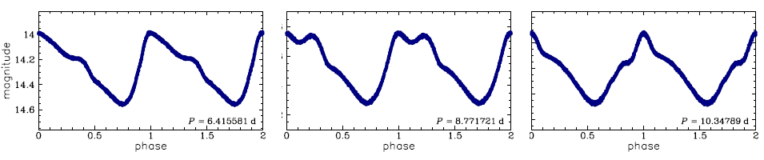
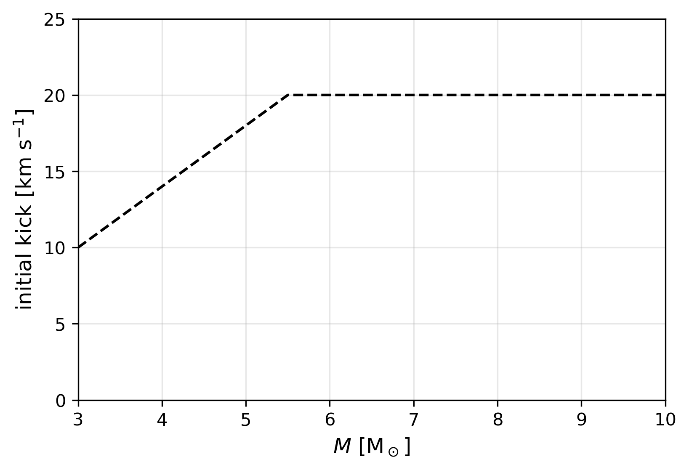

In this lab you will take one of your saved Cepheid models from Lab 1, use a nonlinear pulsation setup to kick it into motion, and inspect the resulting waveform. Your goal is to identify where the bump appears in the cycle and combine your result with the rest of the class to reconstruct the Hertzsprung progression.

This is the nonlinear pulsation lab for Friday. That means the details are a little more technical than in the previous labs, but your job is still very concrete:

1. start from a good Cepheid model
2. run the nonlinear setup
3. inspect the light-curve shape
4. decide where the bump appears

## Background

Many classical Cepheids show a distinctive "bump" in their waveform. The figure below shows a few examples of folded Cepheid light curves observed by the OGLE study:



The location of that bump changes with the pulsation period. In the standard picture, this is related to a near `2:1` resonance between the second overtone and the fundamental mode, so a useful quantity to keep in mind is

$$
P_2/P_0 \approx 0.5.
$$

As the stellar structure changes across the instability strip, the bump shifts from the descending branch, through the middle of the cycle, and onto the rising branch. In this lab, you will see that progression directly in nonlinear MESA models.

## Setting up the work directory

Download `lab3_work_dir.zip` from this [Google Drive](https://drive.google.com/file/d/11S0DjI8fPOw3Szli0Zpn-k8VdDDfP7YQ/view?usp=drive_link), unzip it into some empty directory and `cd` into that directory. You'll see that it already contains the inlists you will need. However, we need to provide TDC with a starting model to make an envelope model from to track the pulsations, just as we did with RSP in lab 2. To that end, copy the `.mod` files you created in lab 1

```bash
cp -r /path/to/your/lab1/mod_dir/ .
```

> [!IMPORTANT]
> Keep your Lab 1 and Lab 3 runs in separate working directories.

Alternatively, you can download the models from the [Lab 1 mod file solutions](https://drive.google.com/drive/folders/1jBEtn-JCkOq15l9cT3Z_L_jecpIAqeKs?usp=share_link), which are zipped by mass.

> [!IMPORTANT]
> Lab 3 uses a saved `.mod` file from Lab 1. It does **not** use a `photos/` restart file from Lab 1.

<!-- It is also helpful if you still have the following information from lab 1 written down somewhere:

- your initial mass
- the name of the saved `.mod` file you want to carry forward
- the matching `log L` and `log T_eff`
- any period or growth-rate information you identified from the GYRE output -->


## Main Goal

By the end of this lab, your group should be able to answer:

- What is the period of your nonlinear Cepheid model?
- Where is the bump in the waveform?
- How does that compare with the rest of the class sample?

## Task 1: Choose a Starting Model

Take a look inside `mod_dir/`. These are the saved stellar structures that Lab 3 can use.

The filenames are written in the form

```text
modelNumber_currentMass_effectiveTemperature_luminosity.mod
```

Choose a model that:

- is in the Cepheid part of the blue loop
- preferably showed positive fundamental-mode growth in Lab 1 or Lab 2
- has a period in the bump-Cepheid regime identified by the TA
- is part of the shared class sample, so different groups cover different periods

> [!TIP]
> If you completed Lab 2, the best starting point is usually a model that already looked promising in the linear analysis.

> [!NOTE]
> These `.mod` files come from the second part of Lab 1, after you restarted the evolution with `./re` and let the star pass through the Cepheid phase while GYRE was running during the evolution.

> [!CAUTION]
> In Lab 1, restarting with `./re` appends to the existing `history.data` file. That means model numbers in the history output may not increase monotonically. If you go back to Lab 1 to recover period or growth information for a saved model, keep that in mind while matching rows in `history.data`.

## Task 2: Edit the Lab 3 Inlist

Open `inlist_pulses` in your editor.

Find the line

```fortran
load_model_filename = 'mod_dir/YOUR_MODEL.mod'
```

For your first run:

- update `load_model_filename` so it points to the model you copied into your local `mod_dir/`

> [!NOTE]
> In this setup, MESA loads the saved stellar structure, removes the core, remeshes the envelope for time-dependent convection, and then uses a GYRE kick to seed the fundamental radial mode.

## Task 3: Choose and set an initial kick

It can take a very long time for a MESA TDC model to start pulsating "naturally". Therefore, we enforce a given radial velocity on the envelope to get the pulsating going, known as an 'initial kick'. The closer this kick is to the final pulsational radial velocity, the faster a bump in the light curve will develop.

From the figure below, read off a reasonable initial kick for your chosen model.



Now add this value into your *inlist_pulses*. **Question:** Can you find which variable stores the initial kick?



There exists no dedicated field for the initial kick of a Cepheid in MESA, so the official MESA documentation won't be of help.

Instead, think about which variables one uses when defining custom quantities in a MESA inlist.






Find and update this line in the `&controls` of *inlist_pulses*:

```fortran
    x_ctrl(6) = 10d0 ! initial vsurf (kms)
```



> [!CAUTION]
> In real scientific applications, it is safest to give the Cepheid a small initial kick and give the model a long time to converge to its final value. In this lab however, it is ok to risk using a large kick to save time.

## Task 4: Compile and Run the Model

First compile the work directory:

```bash
./clean
./mk
```

> [!TIP]
> Make sure you are running inside your extracted Lab 3 work directory before calling `./clean`, `./mk` or `./rn`.

If the compilation succeeds, start the nonlinear run:

```bash
./rn
```

> [!WARNING]
> These inlists are set up so this TDC run continues **indefinitely**! As such, it is up to you to decide when to end the run using ctrl+C (Linux) or cmd+C (Mac).
> Be warned, this will likely take at least 10 minutes. In the meantime, read through the tasks below. If you reach the end of these tasks and your waveform has not stabilised, take a look at the _If You Are Still Waiting on a Run_ section.


## Task 5: Watch the Diagnostics


The main outputs from the run are written to:

- `LOGS_pulsation/`
- `png_pulsation/`
- `photos/`
- `final.mod`

The quickest things to watch are:

- the PGSTAR panels, if you are using graphics
- the terminal output
- `LOGS_pulsation/history.data`

Useful quantities already written by the setup include:

- `period`
- `growth`
- `delta_R`
- `delta_logL`
- `delta_Mag`
- `KE_growth`
- `KE_growth_avg`
- `num_periods`

You do **not** need to understand every quantity in detail to complete the lab. Focus on whether the pulsation becomes coherent and whether the waveform becomes interpretable.

## Task 6: Decide Whether the Run Is Good Enough

For the purpose of this lab, the run is useful once you can see that the kick has produced a coherent pulsation and the amplitude is either:

- still clearly growing
- or close to a repeating finite-amplitude cycle

Signs that the run is doing the right thing:

- `growth` is positive for at least part of the run
- `delta_R`, `delta_logL`, or `delta_Mag` are no longer consistent with numerical noise
- the light, radius, or velocity curves begin to repeat from cycle to cycle

You can see an example of healthy, developed pulsation below.


The five panels labeled with a red number are the most relevant. They show

1. Hertzsprung-Russell diagram. Initially, we expect an ellipsoidal path until the bump develops.
2. luminosity variation in solar luminosity over time, also called the light curve
3. absolute magnitude variation over time
4. radial variation over time
5. radial velocity profile. The initial kick should be plainly visible here


Signs that you should stop and rethink:

- the run exits immediately
- the model never develops a clear periodic signal
- the waveform looks obviously pathological rather than pulsational

> [!IMPORTANT]
> You do not need a perfect production-quality nonlinear model. You only need a waveform that is good enough to classify the bump.

## Task 7: Restart the Run If Needed

If the run stops but has already written restart photos, you can continue from the most recent one:

```bash
./re
```

To restart from a specific photo file:

```bash
./re photo_name
```

This is useful if the model is progressing normally but simply needs more cycles before the bump becomes easy to classify.

> [!NOTE]
> Just as in Lab 1, these `photos/` files are for continuing your own run on your own machine.

## Task 8: Inspect the Waveform

Now look at the waveform and decide where the bump appears in the cycle.

Use whichever of these is easiest for your group:

1. PGSTAR while the run is happening
2. the saved plots in `png_pulsation/`
3. the time series in `LOGS_pulsation/history.data`

If possible, inspect more than one diagnostic. The bump is often easiest to see in a light-like curve, but the radius and surface-velocity curves can help you decide whether a feature is real.

Use the following simple classification:

- `descending branch`: the bump appears after maximum light while the curve is falling
- `middle`: the bump is near the middle of the cycle and not clearly tied to either branch
- `rising branch`: the bump appears before maximum light while the curve is rising
- `no clear bump`: use this only if the waveform is genuinely ambiguous

> [!TIP]
> Do not spend too long debating a borderline case. If the bump is ambiguous, record that uncertainty and move on.

## Task 9: Record Your Result

Add one row for your successful model to the shared class table.

At minimum, record:

- model filename
- initial mass
- `log L` and `log T_eff`, if available from Lab 1
- fundamental period
- whether the pulsation was clearly established
- bump classification
- a short note such as `clear bump`, `weak bump`, or `needed restart`

Once the class table starts to fill up, sort the entries by period and look for the bump progression across the sample.

## Task 10: If You Have Extra Time

If your group finishes the core lab early, here are the most useful next steps, in recommended order:

1. run a second model at a different period
2. improve the first run by restarting it and letting the waveform settle further
3. compare your nonlinear result directly with the linear information you already gathered in Lab 2
4. look more carefully at how the bump appears in luminosity, radius, and velocity together

You do not need to complete all of these. Pick the next one that feels most useful.

### Option A: Run a Second Model

The best use of extra time is usually to run a second model with a different period. This gives you a direct comparison inside your own group.

When choosing the second model, try to pick one that is:

- nearby in period to your first model, if you want to study the transition carefully
- clearly separated in period from your first model, if you want a stronger contrast

After the second run, compare:

- the period
- the bump location
- how obvious the bump is
- whether the waveform shape changes smoothly or dramatically

### Option B: Let the First Run Settle Further

If your first model looks promising but not yet clean, restart it and let it continue for more cycles:

```bash
./re
```

This can be especially helpful if:

- the bump is present but weak
- the amplitude is still clearly evolving
- the waveform is almost, but not quite, repeating cleanly

> [!TIP]
> A cleaner single run is often more scientifically useful than a rushed second run.

### Option C: Compare Back to Lab 2

If you completed Lab 2, compare your nonlinear result with the linear information you already had for the same model.

Ask yourself:

- did a model with positive linear growth turn into a useful nonlinear pulsator?
- is the nonlinear period similar to the period you expected from the linear analysis?
- did the model you thought would be interesting actually produce a clear bump?

This is a nice way to connect the Friday labs together.

### Option D: Compare Different Diagnostics

If you have a clearly pulsating model, compare the bump location in:

- luminosity-related behavior
- radius
- surface velocity

You may find that the bump is easier to identify in one diagnostic than another. Record that in your notes if it helps explain your classification.

<!-- Mathijs to Andy: If you alter the options in here per my comments, you may also want to move this little task someplace higher. I'll leave that up to your sound judgement! -->
### Option E: Making a movie

Isn't that animated PGSTAR window neat?! Unfortunately, it vanishes once you end the run. Luckily, a bunch of `.png` files are outputted by MESA, which can be used to recreate the animated PGSTAR plots. You could either flick through them in an image viewer or combine them into a proper movie. MESA comes packaged with some tools to make such movies. To do so, run the following in your terminal

```bash
images_to_movie "png_pulsation/*.png" my_Cepheid_movie.mp4
```

> [!TIP]
> This `images_to_movie` command lives in the MESA SDK. If the command above ever fails, double-check that the SDK is initialised using `echo $MESASDK_ROOT`.

## Troubleshooting



Check that:

- the file really exists inside `TDC_Cepheid/mod_dir/`
- `load_model_filename` matches the filename exactly
- you are running from inside `TDC_Cepheid/`





Try these in order:

- verify that you chose a genuine Cepheid candidate from Lab 1
- if you completed Lab 2, switch to a model that showed positive fundamental-mode growth there
- restart with `./re` and let it continue longer
- switch to a TA-recommended fallback model rather than spending the whole lab debugging one difficult case





Compare more than one diagnostic:

- light-like behavior from luminosity or `delta_Mag`
- radius variations
- surface velocity

If the same feature appears consistently in more than one place, it is more likely to be real. If not, mark the case as uncertain and move on.



## Challenge Problems

If your group finishes early, try one of these:

- run a second model at a different period and see whether the bump moves
- continue the first model longer and decide whether the bump classification becomes more secure
- compare two nearby models and decide whether the bump progression changes smoothly or abruptly
- use your Lab 2 linear results to estimate where `P_2/P_0` is closest to `0.5`, then see whether that corresponds to the most interesting waveform shape
- compare the bump location in luminosity, radius, and velocity and decide which diagnostic is most useful
- if you find an unstable radial overtone case, record it as a comparison case, but keep your main focus on the fundamental-mode Hertzsprung progression

### Bonus coding task: time-average the light curve over one cycle

If you would like a more coding-focused extension, modify `run_star_extras` so that it measures a cycle-averaged quantity from the nonlinear light curve and compares that average with the corresponding static value from the original model.

One possible version of this task is:

1. identify one full pulsation cycle after the model has reached a reasonably repeatable waveform
2. measure a quantity over that cycle, such as luminosity or magnitude
3. compute the time average over the cycle
4. compare that cycle-averaged value with the static value from the original stellar model

For example, you might compare:

- cycle-averaged luminosity versus the original static luminosity
- cycle-averaged magnitude versus the magnitude implied by the static model

> [!NOTE]
> A simple arithmetic average over output points is not always the same as a true time average if the output sampling is uneven. A better version of this task is to weight the average by the timestep or by the time interval between samples.

Here is one reasonable way to implement this:

#### Step 1: Find the relevant source files

The most useful files to inspect are:

- `src/run_star_extras.f90`
- `src/run_star_extras_TDC_pulsation.inc`
- `src/run_star_extras_TDC_pulsation_defs.inc`

The existing Lab 3 setup already computes per-cycle quantities such as:

- `period`
- `delta_logL`
- `delta_Mag`
- `KE_growth_avg`

and writes them out through the extra-history-column machinery. That makes this a natural place to add one or two more derived quantities.

#### Step 2: Choose what you want to average

Start with one quantity only. Good choices are:

- luminosity
- `log_L`
- a magnitude-like quantity

The simplest first version is to time-average luminosity over one completed pulsation cycle.

#### Step 3: Decide what you will compare against

Pick the corresponding static quantity from the original model. For example:

- cycle-averaged luminosity compared with the model luminosity before the nonlinear pulsation becomes large
- cycle-averaged magnitude compared with the magnitude implied by the static luminosity

You do not need to design a perfect scientific definition here. The point is to compare a static value with the value implied by the nonlinear cycle.

#### Step 4: Accumulate the average over one cycle

As the run advances, keep track of:

- the value of the quantity you are averaging
- the elapsed time associated with each sample
- the running weighted sum over the current cycle
- the total elapsed time over the current cycle

In other words, your code should conceptually build something like

$$
\langle X \rangle = \frac{\sum X_i \Delta t_i}{\sum \Delta t_i}
$$

over one pulsation cycle.

> [!TIP]
> If you want a simpler first attempt, you can average over the samples within one cycle without time weighting. Just be clear in your notes that this is an approximation.

#### Step 5: Reset the accumulators at the start of a new cycle

The existing pulsation code already keeps track of completed cycles and period-level information. Use that logic to decide when one cycle has ended and the next has begun.

At the end of each completed cycle:

- compute the average
- save the result somewhere
- reset the running sums for the next cycle

#### Step 6: Expose the new quantity in the history output

Once you have computed your new cycle-averaged quantity, add it to the custom extra history columns so it appears in `history.data`.

That means updating the part of the code that currently exports values like:

- `period`
- `growth`
- `delta_R`
- `delta_Mag`

You can either:

- replace one of the less important bonus outputs for your experiment, or
- increase the number of extra history columns and append your new quantity

#### Step 7: Recompile and rerun

After editing the Fortran source:

```bash
./clean
./mk
./rn
```

or, if you want to continue from a previously saved nonlinear run after recompiling:

```bash
./clean
./mk
./re
```

#### Step 8: Compare the nonlinear average with the static value

Once your new quantity appears in the output, compare:

- the cycle-averaged value from the nonlinear run
- the corresponding static value from the original model

You can do this for one cycle or for several successive cycles if the run is still evolving.

#### Step 9: Interpret what you find

Write down a short conclusion:

- are the two values nearly the same?
- is there a systematic offset?
- does the offset shrink or grow as the pulsation settles?
- does averaging luminosity directly give a different answer than averaging a magnitude-like quantity?

Questions to think about:

- does the cycle-averaged value match the static value closely?
- if not, is the difference large enough to matter observationally?
- does the answer depend on whether you average luminosity directly or average a magnitude-like quantity?

> [!TIP]
> Keep this as a bonus task. The goal is not to build a perfect analysis pipeline, just to explore whether the nonlinear cycle average differs in an interesting way from the static model value.

## Questions for Discussion

As the class table fills in, discuss these questions at your table:

- how does bump location change with period?
- where does the bump move from the descending branch to the rising branch?
- does the class sample support the idea that the morphology is tied to the `P_2/P_0 \approx 0.5` resonance?
- what does the nonlinear waveform show that the linear analysis in Lab 2 could not show on its own?

## If You Are Still Waiting on a Run

Nonlinear runs do not always line up perfectly with classroom timing. If your model is still running and you have some idle time, use that time to do one or more of the following:

- review your Lab 2 notes and make sure your expected period is written down
- look at the shared class table and decide which period range is still undersampled
- inspect the output files you already have and make a preliminary guess about the bump
- compare what you are seeing in PGSTAR with what appears in `history.data`

That way, even waiting time stays scientifically useful.

## Suggested Reading

- [Farag et al. 2026, self-consistent nonlinear classical Cepheid pulsations during stellar evolution with MESA](https://arxiv.org/abs/2603.15766)
- [Bono, Marconi, and Stellingwerf 2000, the Hertzsprung progression](https://ui.adsabs.harvard.edu/abs/2000A%26A...360..245B/abstract)
- [Marconi et al. 2024, the Hertzsprung progression of classical Cepheids in the Gaia era](https://ui.adsabs.harvard.edu/abs/2024MNRAS.529.4210M/abstract)
