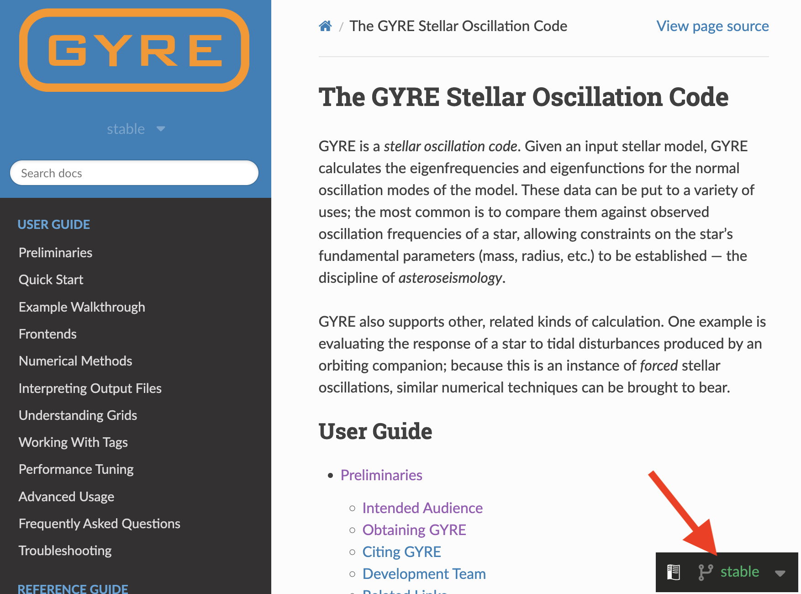

# Lab 1 - Finding the Beat

## Learning Goals

- Install GYRE
- Set up MESA to use GYRE
- Calculate period spacing using MESA and GYRE

Acknowledgement:
This tutorial is largely inspired by [similar labs for the 2025 MESA Summer School](https://mesa-leuven.4d-star.org/tutorials/friday/) and the [GYRE documentation](https://gyre.readthedocs.io/en/stable/index.html).

## Building GYRE

### Your star’s personal sound system

`MESA` is distributed with two codes for stellar oscillations:

- [`GYRE`](https://gyre.readthedocs.io/en/stable/), by R. H. D. Townsend, and
- [`ADIPLS`](https://ui.adsabs.harvard.edu/abs/2008Ap%26SS.316..113C/abstract), by J. Christensen-Dalsgaard.

The two codes perform broadly similar calculations, with the main tradeoff being performance versus ease of use. In this tutorial, we will focus on `GYRE`, which is much easier to get started with.

<!-- ### Download GYRE -->
### Getting started: download GYRE
When you download MESA, `GYRE` is automatically included as one of the folder. For MESA version r26.4.1, the shipped GYRE version is 8.1. Make sure you are viewing the documentation corresponding to the version of GYRE you are using. You can check the version number that you have by:

```shell
ls $MESA_DIR/gyre/*.tar.gz
```

You will see something like
`
path_to_mesa/gyre/gyre-8.1.tar.gz
`
, where 8.1 tells you the version nubmer. 

On the website, you can change the version by clicking the small box on the right bottom corner.


> [!Tip]
> We will use the version of `GYRE` shipped with MESA for this tutorial (v8.1). However, you may wish to explore the latest release (v9.0) later, which will produce the same results but much faster. See the release notes [here](https://github.com/rhdtownsend/gyre/releases/tag/v9.0).

Optionally, if you would like to use the latest version of GYRE, download the source archive from the official website, place it wherever you like, and extract it with:
```shell
tar xf gyre-9.0.tar.gz
```

<!-- ### Set Environment Variables -->
### Bonding session: set environment variables
Secondly, we will set the environment variable `$GYRE_DIR` to the path to source directory of gyre.

```shell
export GYRE_DIR=path/to/gyre
```

>[!Tip]
> If you are using the `GYRE` shipped with MESA, the path should be: 
> ```shell
> export GYRE_DIR=$MESA_DIR/gyre/gyre
> ```

Remember that this is best placed inside your shell's RC file in your home directory (usually `.bashrc` or equivalent), similarly to when you first installed MESA. **Don't forget to `source` this file to apply the changes to your terminal window!**

<!-- ### Compile -->
### Now we cook: compile
Now, we can follow the GYRE installation guide from this point. Go ahead and compile:

```shell
make -j -C $GYRE_DIR install
```

<!-- ### Test -->
### The moment of truth: test the installation
Once compilation is complete, run the test to verify that the installation succeeded:

```shell
make -C $GYRE_DIR test
```

> [!NOTE]
> If all the tests read "...succeeded" then you are good to move on to the next step. If that's not the case, ask a TA or developer for help. 

## Use GYRE with MESA model

We will now connect GYRE to a real stellar structure model produced by MESA and compute oscillation modes.

### Loaded it up: get the MESA model
In this tutorial, we will focus on the usage of GYRE, so we have prepared a simple 5-solar-mass stellar model to get you started. You will learn about the setup in MESA in the next tutorial.

#### Task: get the working directory

Download the working directory [here](https://drive.google.com/file/d/1vIep2i8uy73ry3Y3455iiYbZ2Vg3aVRM/view?usp=drive_link), unzip it, and move into the folder.



```shell
unzip day2_lab1.zip
cd day2_lab1
```



You should see something like this in the folder:
```
.
├── 5M_at_ZAMS.mod
├── LOGS_zams
│   ├── history.data
│   ├── profile1.data
│   ├── profile1.data.FGONG
│   └── profiles.index
├── README.rst
├── clean
├── history_columns.list
├── inlist
├── inlist_pgstar
├── inlist_zams
├── make
│   └── makefile
├── mk
├── photos
│   └── x197
├── re
├── rn
└── src
    ├── run.f90
    └── run_star_extras.f90

5 directories, 18 files
```

### Know your GYRgons: GYRE namelist

Similar to MESA, GYRE takes an input file in the format of `namelist`. Create a file called `gyre.in` in your favorite text editor, and paste the following lines into this file. 
```fortran
&constants
/

&grid
/

&model
/
 
&mode
/

&num
/
 
&osc
/
 
&rot
/

&scan
/

&ad_output
/
 
&nad_output
/

```
>[!IMPORTANT]
> Don't forget to add an empty line at the end of the file!

The namelist is separated into different groups, a full explanation of the different groups and their members can be found in the [documentation](https://gyre.readthedocs.io/en/stable/ref-guide/input-files.html). In the following, we will only cover the most essential sections needed to get started.


#### Grid Parameters

This group controls the spatial resolution of the grid used by GYRE to compute oscillation modes. The grid resolution determines the spacing between adjacent points in the stellar model.

A finer grid generally improves:
- the accuracy of the computed eigenmodes,
- and the number of modes that GYRE can successfully detect.

However, increasing the number of grid points also increases the computational cost.

To accurately resolve oscillation modes, the grid spacing should be smaller than the scale of the smallest significant variation in the eigenfunctions. The grid can be refined using weighting parameters such as `w_osc`, `w_exp` and `w_ctr`. These parameters are set to zero by default, in which case the spatial grid from the stellar model is used directly for the oscillation calculation. For our models, this default configuration is sufficient. However, higher values may be required for more realistic stellar applications.

Further details on how these parameters affect the grid can be found in the GYRE documentation on spatial grids [here](https://gyre.readthedocs.io/en/stable/user-guide/understanding-grids/spatial-grids.html#spatial-grids). 


<!-- ##### Task: Set the grid refinement parameters
Search in the GYRE documentation for appropriate values for `w_osc`, `w_exp` and `w_ctr` and set them in the corresponding namelist group.



You can find them for example at the bottom of [this page](https://gyre.readthedocs.io/en/stable/user-guide/understanding-grids/spatial-grids.html#recommended-values).

```fortran
&grid
    w_osc = 10 ! Oscillatory region weight parameter
    w_exp = 2  ! Exponential region weight parameter
    w_ctr = 10 ! Central region weight parameter
/
```
 -->

#### Model

Here we tell GYRE what stellar model to use for computing oscillation frequencies.

##### Task: tell GYRE the type of model to use and lead the path

Read the documentation on the [Model Namelist Group](https://gyre.readthedocs.io/en/stable/ref-guide/input-files/model-group.html), and fill the `<MODEL_TYPE>` and `<PARAM>`.

```fortran
&model
    model_type = <MODEL_TYPE>
    <PARAM> = './LOGS_zams/profile1.data.FGONG'
    file_format = 'FGONG'
/
```


```fortran
&model
    model_type = 'EVOL'
    file = './LOGS_zams/profile1.data.FGONG'
    file_format = 'FGONG'
/
```


`model_type` tells GYRE what kind of stellar model is being used. Here, 'EVOL' indicates that we are using an evolutionary model (from MESA in our case). `file` pinpoints the location of the model file, and `file_format` specifies the format of the input file. In this case, it is FGONG.

#### Mode
This namelist group defines which oscillation modes you want to GYRE to search for. You can specify the angular degree ($\ell$) and the azimuthal order ($m$). 

> [!Tip]
> For each type of mode we will need one extra `&mode` namelist group.

##### Task: Complete the Mode Namelist Group
We want the oscillation modes with $\ell=1$ and $m=0$, and limit the radial order between -50 and -1. Search in the documentation the relevant parameters and complete the `&mode` namelist group.



```fortran
&mode
    l = 1
    m = 0
    n_pg_min = -50
    n_pg_max = -1
/
```



<!-- > [!CAUTION]
> Add more explanation about things? tags?  -->

#### Oscillation parameters

In this namelist group, we can configure the treatment of the stellar oscillation equations. This includes options such as the boundary conditions and the scaling factors of different physical terms in the equations.

GYRE provides many options for controlling the underlying physics of the oscillation calculations. A full list of available parameters and their default values can be found in the GYRE oscillation group documentation [here](https://gyre.readthedocs.io/en/stable/ref-guide/input-files/osc-group.html).

To keep things simple, we will use the default outer boundary condition, which assumes that the density vanishes at the stellar surface:

```fortran
&osc
    outer_bound = 'VACUUM'
/
```

#### Frequency Scan Parameters

This section defines the frequency grid used by GYRE to search for oscillation modes. 

Unlike the spatial grid, which discretizes the oscillation equations inside the star, the frequency grid determines the range and resolution over which GYRE searches for eigenfrequencies.

The choice of `grid_type` depends on the type of modes being studied:
- For p-modes, which are approximately equally spaced in frequency in the asymptotic limit, a linear frequency grid is usually preferred, i.e., ` grid_type = 'LINEAR'`;
- For g-modes, which are approximately equally spaced in period, an inverse-frequency grid is more appropriate, therefore, `grid_type = 'INVERSE'`.

To reliably detect all modes, the scan grid spacing should generally be smaller than the separation between adjacent eigenfrequencies across the full scan range. If the grid is too coarse, some modes may be missed; if it is too fine, the runtime increases significantly. There is no universal choice for the scan parameters, and they often need to be adjusted depending on the type of modes and frequency range of interest.

Here we are interested in g-modes, so we choose grid_type = 'INVERSE',

##### Task: Configure the frequency scan
Complete the `&scan` namelist group in `gyre.in` to:
- use an inverse-frequency grid,
- scan frequencies between 0.1 and 10 cycles per day,
- use 5000 frequency points,
- and express frequencies in cycles per day.

Search the documentation for the relevant parameter names and fill in the values.


```fortran
&scan
    grid_type = 'INVERSE'   ! Scan grid uniform in inverse frequency
    freq_min = 0.1          ! Minimum frequency to scan from
    freq_max = 10           ! Maximum frequency to scan to
    n_freq = 5000           ! Number of frequency points in scan
    freq_units = 'CYC_PER_DAY'
/
```


#### Output

Finally, we need to tell GYRE what information it should save from the oscillation calculations.

GYRE provides two main types of output files:
- summary files, which contain global properties, such as eigenfunctions and radial orders, of all computed modes,
- detail files, which store the eigenfunctions and structural information for individual modes.

For now, we will focus only on the summary output. Here you can include all quantities that describe the mode with a single value e.g. $\ell$, $m$, $n$, frequency, inertia, and more.  A full list of available output quantities can be found in the [summary files documentation](https://gyre.readthedocs.io/en/stable/ref-guide/output-files/summary-files.html). The name of the file is given by the `summary_file` and the quantities it should include are given with `summary_item_list`.

To remain consistent with our frequency scan, do not forget to set: `freq_units = 'CYC_PER_DAY'`.

##### Task: Settings for output files
Put the following lines to define your output into the `&ad_output` of your `gyre.in` file. Adjust the location of your output file as you see fit.

```fortran
&ad_output
    summary_file = 'summary_zams.h5'
    summary_item_list = 'l,n_pg,m,freq,period'
    summary_file_format = 'HDF'
    freq_units = 'CYC_PER_DAY'
```

> [!Tip]
> The output settings are placed inside the `&ad_output` namelist group, indicating that we are performing an adiabatic oscillation calculation. If we want to instead calculate it non-adiabatically we would need to put it in `&nad_output` instead. 

### Putting it all together

#### One last check
Before we procee to run GYRE, you might check that you have everything in place.



```fortran
&constants
/

&model
    model_type = 'EVOL'
    file = './LOGS_zams/profile1.data.FGONG'
    file_format = 'FGONG'
/

&mode
    l = 1
    m = 0
    n_pg_min = -50
    n_pg_max = -1
/

&osc
    outer_bound = 'VACUUM'
/

&scan
    grid_type = 'INVERSE'
    freq_min = 0.1
    freq_max = 10
    n_freq = 5000
    freq_units = 'CYC_PER_DAY'
    freq_min_units = 'CYC_PER_DAY'
    freq_max_units = 'CYC_PER_DAY'
/

&rot
/

&grid
/

&num
/

&ad_output
    summary_file = 'summary_zams.h5'
    summary_item_list = 'l,n_pg,m,freq,period'
    summary_file_format = 'HDF'
    freq_units = 'CYC_PER_DAY'

&nad_output
/

```



<!-- >[!Tip]
> Sometimes it can be useful to check out the [troubleshooting](https://gyre.readthedocs.io/en/stable/user-guide/troubleshooting.html) section of the website. -->

#### GYRE it up

Now you are all set! Go ahead and run GYRE:
```shell
$GYRE_DIR/bin/gyre gyre.in
```

#### See the beat

The easiest way to visualize GYRE output is with the Python package `pygyre`, available on the Python Package Index ([PyPI](https://pypi.org/)).

You can install it with:
```shell
pip install pygyre
```

We have prepared a [Google Colab](https://colab.research.google.com/drive/1i3vLNluWk44EUli_asEY4Pvnkbwme5kS?usp=sharing). Before editing the notebook, save a copy to your own Google Drive (`File → Save a copy in Drive`), otherwise your changes may not persist. If you have pygyre downloaded, you can download the notebook and work locally.

##### Task: plot the period spacing
Upload your summary file to the Google Colab, and plot the period spacing. What do you expect to see?

If you encounter issues producing the summary file, you can download it [here](https://drive.google.com/file/d/1YA3ZVJdLpy66V9RvRx9BbhHCpYPdBOqs/view?usp=drive_link).




The period spacings are almost constant! 

In the asymptotic limit (high radial order), g-modes period spacings are nearly constant. Deviations from a constant period spacing provide valuable information about the stellar interior, such as chemical gradients, convective boundaries, or rotation.


#### Bonus: more diagnostic from the detail files
> [!Note]
> This is an optional section, make sure to finish the other sections before starting.

As mentioned before, in addition to the summary files, GYRE can have another type of output files called detail files. The detail files provide additional information about individual modes, such as eigenfunctions and propagation properties.

To tell GYRE to output the detail files, add the following lines in the `&ad_output` section:
```fortran
&ad_output
    ....

    detail_template = 'subfolder/detail.l%l.n%n.h5'               
    detail_item_list = 'l,n_pg,omega,x,xi_r,xi_h,c_1,As,V_2,Delta_g,Gamma_1,rho'
/
```
> [!Important]
> GYRE creates one detail file per mode, so the number of output files can grow quickly. To keep things organized, it is convenient to store them in a separate folder.
> 
> However, GYRE does not create directories automatically, so you must create the folder yourself before running GYRE. Name it, for example, `detail_zams`:
> 
> ```shell
> mkdir detail_zams 
> ```
> 
> Replace the `subfolder` by the proper name of your folder. 

The `%l` and `%n` will be replaced by the harmonic degree $\ell$ and the radial order $n_{\mathrm{pg}}$, respectively. For more options, check out the [doc](https://gyre.readthedocs.io/en/stable/ref-guide/input-files/output-groups.html). The `detail_item_list` specifies the quantities we are interested in.

Again,
```shell
$GYRE_DIR/bin/gyre gyre.in
```

Now if you do:
```shell
ls -l detail_zams | wc -l
```
You will see the number of the modes found by GYRE.

##### Bonus task: inspect the propagation diagram

The propagation diagram is basically a “map” showing where different types of waves can and cannot travel inside a star. The Brunt–Väisälä frequency ($N$) and the Lamb frequency ($S_\ell$) set the boundaries of the propagation regions: gravity waves propagate where $\omega^2 < N^2$ (g mode cavity), while pressure waves propagate where $\omega^2 > S_\ell^2$ (p mode cavity).

Go to the [Google Colab](https://colab.research.google.com/drive/1i3vLNluWk44EUli_asEY4Pvnkbwme5kS?usp=sharing), upload one of your detail files there, and use the provided plotting function `plot_propagation_diagram` to plot the propagation diagram.

If you encounter issues producing the detail files, we have prepared the ones for [`n_pg=-1`](https://drive.google.com/file/d/1HRUboEwwKufIM08mbWCY2U-0PMqnWFz-/view?usp=drive_link), [`n_pg=-25`](https://drive.google.com/file/d/1G-6CtnQtrr5cEY8jqPZL38Ry_aig90rO/view?usp=drive_link), and [`n_pg=-45`](https://drive.google.com/file/d/1tQ_nhhNdqoO-cI3jUEtwkstesO3vSIV1/view?usp=drive_link), also discuss with others to see what they get.





By looking at the position of modes on the propagation diagram, one can determine whether a mode can propagate or is evanescent in different regions.



In this case, all the modes lie in regions where propagation is allowed.


#### Bonus task: inspect the displacement eigenfunctions
One can inspect the eigenfunctions of each mode through the detail files. Upload a few detail files to the Google Colab notebook and use the provided plotting functions to inspect the radial (`xi_r`) and horizontal (`xi_h`) displacement eigenfunctions of different modes.

Compare how the eigenfunctions change with radial order.


For `n_pg = -1`:


For `n_pg = -50`:


$\tilde{\xi}_{r}$ and $\tilde{\xi}_{h}$ are the radial and horizontal displacement perturbations, respectively. 

Inside the convective core, the radial and horizontal displacement amplitudes are of the same order because convection produces nearly isotropic, turbulent motions with no strong restoring buoyancy stratification. As a result, oscillatory motions are not strongly constrained into a preferred direction. Outside the convective core, in the stably stratified radiative region, radial motions are suppressed, so horizontal motions dominate. This is characteristic of g mode propagation.



## Bonus: A short introduction to how GYRE finds oscillation modes

GYRE solves the stellar oscillation equations, a set of differential equations and boundary conditions that describe small, periodic perturbations about a star's equilibrium state. Consistent solutions to these equations (known as "modes") can be found only for certain specific choices of the perturbation frequency, and so the frequency takes on the mathematical role of an eigenvalue.

To calculate the frequency eigenvalues (or "eigenfrequencies") of a stellar model (obtained, for instance, from MESA), GYRE sets up a large system of algebraic equations. These equations are derived from finite-difference approximations to the oscillation differential equations, taken between pairs of adjacent spatial grid points. In symbolic form, the algebraic equations can be written as

$$
S u = 0, 
$$

where $S$ is a matrix of coefficients and $u$ is a vector of unknowns representing the perturbations at each grid point. Solutions to this equation only exist when

$$
\det(S) = 0,
$$

and so GYRE's task is to search for the frequencies at which the determinant of $S$ vanishes. Once these eigenfrequencies are found, GYRE reconstructs the associated eigenfunctions (describing the spatial dependence of perturbations) from the vector $u$.

The eigenfrequencies of a star depend on the detailed internal structure of the star. Therefore, by comparing a set of eigenfrequencies for a given stellar model against those observed in a real star, we can test how well the model represents the real star --- a technique known as asteroseismology.

Reference
- [Townsend, R. H. D., & Teitler, S. A. 2013, *MNRAS*, 435, 3406](https://ui.adsabs.harvard.edu/abs/2013MNRAS.435.3406T/abstract)

## Solution
The complete solution is available [here](https://drive.google.com/file/d/1i-TLjnu5GAePKeL9GoNSE-vJQ4YGlRuf/view?usp=drive_link).