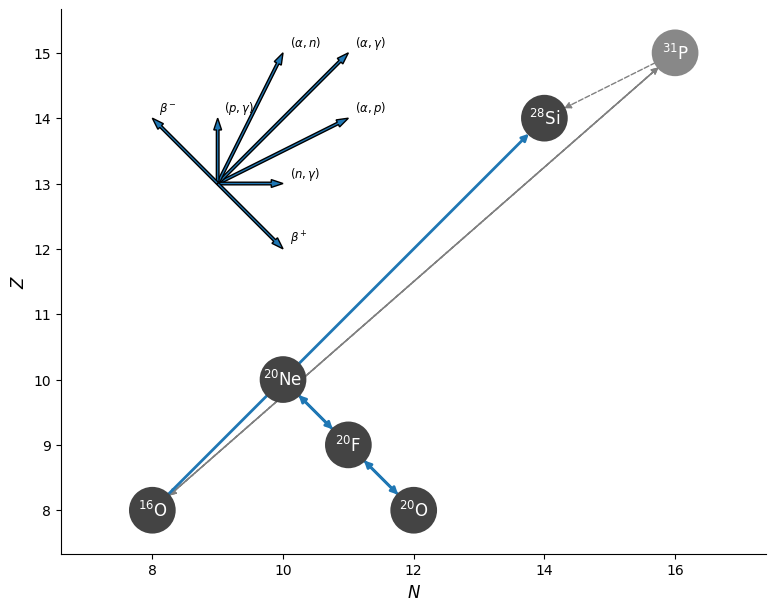

# Minilab 1: Place Your Bets: Explode or Implode?


## Introduction


Electron-capture supernova (ECSN) either result in collapse (cECSN) or thermonuclear explosion (tECSN). Thinking of the core of these 8-10 M<sub>&#9737;</sub> supernova progenitors as an accreting 1.1 M<sub>&#9737;</sub> white dwarf, we can try to map the cutoff between these regimes (implosion versus explosion) using the density and radius of oxygen ignition within the white dwarf.[^Holas26] To account for the role of Urca processes in this balance, it is essential to carefully consider the nuclear network used throughout our models.   

In this lab, we will model the accretion stage of an ONe white dwarf, beginning from a precomputed starting point and evolving to oxygen ignition. To accomplish this, we will build a custom nuclear network and measure the rate balance between electron capture/$\beta^-$ decay rates. In the end, we will map the density at oxygen ignition to answer the question: Will this star explode or implode?

For more discussion on accretion-induced collapse in accreting white dwarfs, see also Schwab&Rocha19[^Schwab19], Schwab+15[^Schwab15], and Piersanti+22[^Piersanti22].

For more discussion on Urca processes, see also Gamow&Schoenberg41[^GamowSchoenberg41], Haensel95[^Haensel95], and Pinedo+14[^MartinezPinedo14].


### Helpful Links


The Google drive for Lab 1 can be found [HERE](https://drive.google.com/drive/folders/1Pht6YvypYnXKGyDYzHVphCF7SZQ7MYAL?usp=drive_link). This drive contains the starting point, partial solutions (separated by task), and a full solution. You do **not** need to download the entire drive! 

Values that need to be altered in the files will generally be marked with `!!!!!`, but feel free to look over the provided solutions if you get stuck! It is **highly** suggested that you use hints where applicable as parts of this lab can be a bit tricky.

If you are unfamiliar with Fortran, see Georgia Tech's [Aerospace Engineering Resource page for Fortran90](https://aeresources.gatech.edu/Fortran/Webpage/) which compiles information on Fortran types/modules/loops/etc at an undergraduate level.

Lastly, it will be helpful to consult the [MESA documentation](https://docs.mesastar.org/en/latest/) throughout this lab.


## How to destroy a White Dwarf in 7(ish) easy steps!


### Step 0: Start Up

| 📋 TASK 1 |
|:--------|
| **Download and unzip** the starting point from the [Google Drive](https://drive.google.com/drive/folders/1wnWBNuUa2h8vivr8JxMhZHLr_toeDSRM?usp=drive_link) to a local working directory. |

This starting point is a standard set of MESA files complete with a precomputed 1.1 M<sub>&#9737;</sub> Oxygen-Neon (ONe) white dwarf model.

After downloading, your working directory should look like:


  
    
    
    
    
    
    
    
    
    
    
    
    
      
      
    
  
 

At this stage, we are now ready to dive into some inlists!


### Step 1: Inlist

`inlist` serves as a direction point for the run, guiding the order and precedence of variables in various other inlist files. Given this, take a peak at `inlist`. For the `&star_jobs`, `&eos`, `&kap`, and `&controls` namelists (ie. groups of variables), the run will begin by pulling in everything from `inlist_common`. Then, for the `&star_job` and `&controls` namelists, the run will overwrite settings using values from `inlist_accrete`. Lastly, the activity of pgstar will be controlled by a separate inlist entirely, `inlist_pgstar`.


### Step 2: Inlist Common

Throughout today's runs, we will be varying the accretion behavior of our system, but expect that some portion of variables will be the same. `inlist_common` holds the set of "defaults" that we want to be common between runs (hence the name), making changes more modular.

Now let's look over the file. You will notice that some variables have already been set to more aggressively relax tolerances. This will help the model converge at later times by loosening what counts as an "ok" step. Check [this](#aside-on-miscellaneous-variable-choices-in-inlist_common) aside **after** the lab for more details on particular choices in this file. 

Next, we want to record the point of oxygen ignition in the white dwarf, but **DO NOT** want to try running through explosion/implosion during these labs. Beyond that point, the relevant timescale will shrink rapidly to that of the deflagration/detonation front, massively increasing the computation required.

| 📋 TASK 2 |
|:--------|
| In `&controls`, **update `inlist_common`** to stop the model once temperature reaches 10<sup>9.1</sup> K (when the white dwarf begins to ignite oxygen). Available stopping parameters can be found [here](https://docs.mesastar.org/en/latest/reference/controls.html#when-to-stop). |


The parameter that should be added is:
- `log_max_temp_upper_limit`




```fortran
! when to stop

     log_max_temp_upper_limit = 9.1d0 !!!!!
```



### Step 3: Inlist Accrete

With the common variables set, now we can focus on the fun part: throwing material on the surface. We will define what this surface is, how it can react, and what the thrown material is within `inlist_accrete`. Unlike our previous inlists, this file has been provided mostly empty. 

Throughout the day, we will be loading in precomputed white dwarf models as starting points to avoid dealing with earlier stages of evolution. The precomputed model for this lab has already been provided in the starting directory as `1.1Msun_ONe.mod`. 

The reaction network will be defined by a file we will create later called `ONe.net` and the rates of reactions in that network will need to use the weak rates of Suzuki+2016[^Suzuki16]. These Suzuki rates are critical for the treatment of degenerate O-Ne-Mg cores as these sd-shell electron capture and β-decay rates drive the Urca process. These Suzuki rates are not only tabulated on a much finer scale than earlier tables, but account for additional transitions critical to our test regime. Without these rates, the weak reaction rates of isotopes with mass number (A) 17 through 28 would be interpolated with earlier weaklib tables that will not sufficiently resolve the cooling/heating features at the core of this lab. 


| 📋 TASK 3 |
|:--------|
| In `&star_jobs`, **update `inlist_accrete`** to: <ul><li>Load the `1.1Msun_ONe` model </li><li> Change the initial nuclear network to `ONe.net`</li><li> Use the Suzuki rates.</li></ul> The relevant `&star_jobs` variables can be found in the [starting model](https://docs.mesastar.org/en/latest/reference/star_job.html#starting-model) and [nuclear reactions](https://docs.mesastar.org/en/latest/reference/star_job.html#nuclear-reactions) sections of the MESA documentation. |



The parameters that should be added are:
- `load_saved_model`
- `load_model_filename`
- `change_initial_net`
- `new_net_name`
- `use_suzuki_weak_rates`


We are only seeking to change the reaction network at the beginning of the run. `change_net` would be used in more complicated inlist arrangements where you want to trigger the reaction network change any time there is a restart (`./re`). 

This is helpful when simulating multiple regimes wherein "inlistA" uses "networkA" until stopping condition A. Then, "inlistB" picks up the run (upon restart) with "networkB" until stopping condition B. 




```fortran
  ! load previous model
    load_saved_model = .true.                   !!!!! 
    load_model_filename = '1.1Msun_ONe.mod'     !!!!!

  ! net
    change_initial_net = .true.  !!!!!
    new_net_name = 'ONe.net'     !!!!!

  ! weak rates
    use_suzuki_weak_rates = .true. !!!!!
```


Next, we want to accrete material of a given composition at a given rate. Generally, this material need not be the same composition as the surface star and may be defined as mass fractions of a variety of species. In this lab, we want the ONe white dwarf "core" to slowly accrete ash from shell carbon-burning which we will take to be equal mass fractions of Oxygen-16 and Neon-20.


| 📋 TASK 4 |
|:--------|
| In `&controls`, **update `inlist_accrete`** to: <ul><li>set the accretion rate to 10<sup>-6</sup> M<sub>&#9737;</sub> / year of equal mass fractions of Oxygen-16 and Neon-20 </li><li> Rename the LOGS directory to a more descriptive name, `LOGS_ONe_1d-6`. </li></ul> The relevant `&controls` variables can be found in the [mass gain or loss](https://docs.mesastar.org/en/latest/reference/controls.html#mass-gain-or-loss), [composition controls](https://docs.mesastar.org/en/latest/reference/controls.html#composition-controls), and [controls for output](https://docs.mesastar.org/en/latest/reference/controls.html#controls-for-output) sections of the MESA documentation. |

> [!NOTE]
> You will need to both explicitly stop MESA from accreting the same composition as the surface and flag that the new accretion composition will be given as mass fractions.

> [!CAUTION]
> The isotope names are **case sensitive** and should be provided in lowercase!


The parameters that should be added are:
- `mass_change`
- `accrete_same_as_surface`
- `accrete_given_mass_fractions`
- `num_accretion_species`
- `accretion_species_id`
- `accretion_species_xa`
- `log_directory`



The accretion of various species is primarily governed by two arrays: `accretion_species_id` and `accretion_species_xa`. Additionally, `num_accretion_species` provides MESA with an expectation value for the lengths of these two arrays. 

The `id` of a particular species is defined through abbreviated isotopic hyphen notation (minus the hyphen) as [Chemical Symbol][Mass Number]. For example, Selenium-80 is se80 and Nickel-56 is ni56. More information on the variety of isotopes available in MESA can be found in `$MESA_DIR/chem/public/chem_def.f90`.

The `xa` is the mass fraction of the particular species, some decimal value less than or equal to 1. 

Therefore, if we wanted to accrete only Hydrogen-2, we would use:
```fortran
    ! Just H2
    num_accretion_species = 1
    accretion_species_id(1) = 'h2'
    accretion_species_xa(1) = 1d0 
```


> [!NOTE]
> Note, arrays in fortran are 1-indexed, so the first entry in an array is array(1) and the second is array(2). 


```fortran
  ! accretion

    mass_change = 1d-6                     !!!!!

    accrete_same_as_surface = .false.      !!!!!
    accrete_given_mass_fractions = .true.  !!!!!

    ! O and Ne
    num_accretion_species = 2
    accretion_species_id(1) = 'o16'  !!!!!
    accretion_species_xa(1) = 0.50d0 !!!!!
    accretion_species_id(2) = 'ne20' !!!!!
    accretion_species_xa(2) = 0.50d0 !!!!!

  ! output

    log_directory = 'LOGS_ONe_1d-6' !!!!!
```



### Step 4: Building a Nuclear Network

As you may have guessed from our prior flags to change the initial net, MESA allows for the creation of custom reaction networks. Reaction networks are descriptions of what isotopes and what reactions between those isotopes are included in our model. The default net, `basic.net`, is a stripped case built primarily for speed in the MESA test suite, **NOT** for proper nucleosynthesis or accounts of burning through the main sequence. For any proper science case, this network will need to be replaced. In general, the use of a particular network should be motivated by the physics that one seeks to explore traded against the additional computational time required on larger nets. 

The minimal structure of a reaction network uses two commands to build a set of isotopes and reactions: `add_isos(<isos_list>)` and `add_reactions(<reactions_list>)`. Other possible commands can be found in the [creating a custom net](https://docs.mesastar.org/en/latest/net/nets.html#creating-a-custom-net) section of the MESA documentation.

| 📋 TASK 5 |
|:--------|
| **Open `$MESA_DIR/data/net_data/nets/basic.net`**, peruse the included isotopes and reactions, and take note of the format. |

In pursuit of our central question, "implode or explode", the critical physics is whether and where our ONe white dwarf enters thermal runaway. This balance requires a nuclear network that accounts for the critical electron-capture (EC) chain Neon-20 -> Fluorine-20 -> Oxygen-20 and the burning of Oxygen-16 to Silicon-28. This electron capture chain follows the logic of an Urca pair, in that it involves cyclic weak reactions between isobars (nuclides with the same mass number, A). However, opposed to traditional Urca pairs, the electron capture reaction on Neon-20 can actually result in local heating! An overview of each of these reactions is below:
| Reaction                     | Equation                                                         |
|------------------------------|------------------------------------------------------------------|
| $EC$ : Ne-20 -> F-20      | $$\ce{^{20}_{10}Ne + e- -> ^{20}_{9}F + \nu_e}$$                 |
| $\beta^-$ : F-20  -> Ne-20   | $$\ce{^{20}_{9}F -> ^{20}_{10}Ne + e- + \bar{\nu}_e}$$           |
| $EC$ : F-20  -> O-20      | $$\ce{^{20}_{9}F + e- -> ^{20}_{8}O + \nu_e}$$                   |
| $\beta^-$ : O-20  -> F-20    | $$\ce{ ^{20}_{8}O -> ^{20}_{9}F + e- + \bar{\nu}_e}$$            |
| O-16 Burning                 | $$\ce{^{16}_{8}O + ^{16}_{8}O -> ^{28}_{14}Si + ^4_2\text{He}}$$ |

> [!NOTE]
> In MESA, "weak" denotes the weak reactions that lower nuclear charge, while "weak_minus" denotes the weak reactions that raise the nuclear charge. The rates we use will include the contributions of electron capture and positron emission or electron emission and positron capture as appropriate. The above table only uses EC and $\beta^-$ as a label for simplicity, as these contributions should be dominant in our degenerate regime. 

This network is visualized in the figure below:


*Directed graph, generated with pynucasto, showing the isotopes in the network and the decay processes between them. The compass rose shows the directionality of particular processes in the graph: $\beta$, $\beta^-$, or (projectile, ejectile), where $\alpha$ is an alpha particle, $p$ is a proton, $n$ is a neutron, and  $\gamma$ is a photon. The gray ${}^{31}\mathrm{P}$ nucleus is not explicitly carried in the network, but we include the link ${}^{16}\mathrm{O}({}^{16}\mathrm{O},p){}^{31}\mathrm{P}(p,\alpha){}^{28}\mathrm{Si}$ as an alternate pathway to ${}^{16}\mathrm{O}({}^{16}\mathrm{O},\alpha){}^{28}\mathrm{Si}$ for oxygen burning (this is included in the MESA rate we use).*


| 📋 TASK 6 |
|:--------|
| **Create a new file, `ONe.net`, in your working directory**, and **add the necessary isotopes** to encompass the reactions in the table above. |

> [!CAUTION]
> You must also add Hydrogen to the mix! MESA **requires** all nuclear networks to contain both Hydrogen-1 and Helium-4. 


The isotopes that should be added are:
- Hydrogen-1 
- Helium-4
- Oxygen-16
- Neon-20 
- Fluorine-20
- Oxygen-20 
- Silicon-28



To add an a group of isotopes, use 
```fortran
add_isos(
    iso_i
    iso_ii
    ...
    iso_n
	)
```

Isotopes of the same element can either be written separately on new lines, or written on the same line with mass numbers separated by a space:
```fortran
!ie, for Zinc 64 and Zinc 66: 
zn64
zn66

! OR
zn 64 66
```



```fortran
!!!!! Add Isotopes
add_isos(
     h1
     he4
	 ! for Ne20 - F20 - O20
	 ne20
	 f20
	 o20
	 ! for O ignition
     o16
	 si28
	 )
```



With the isotopes added, we may now move to add our specific reactions. Again, the consideration of reactions should depend on the physics in question. In our case, as previously mentioned, we only need to include the four $EC$/$\beta^-$ reactions and oxygen-16 burning, as described in the table.

| 📋 TASK 7 |
|:--------|
| In `ONe.net`, **add the reactions from the table above**. |

> [!NOTE] 
> Use the [desciption of net format](https://docs.mesastar.org/en/latest/net/nets.html#description-of-net-format) in the MESA documentation to find the `reaction_handle` (ie. reaction name) format for the standard 1-to-1 weak reactions.
> For oxygen burning, the `reaction_handle` can be found in `$MESA_DIR/data/rates_data/reactions.list`.


1-to-1 Z-decreasing reactions (positron emission or electron capture) between reactant x and product y follow the naming `r_x_wk_y`.

1-to-1 Z-increasing reactons (electron emission or positron capture) between reactant x and product y follow the naming `r_wk-minus_y`.

Note, x and y are the abbreviated isotope names (ie. Uranium-238 would be `u238`)



It is the first entry describing 2 Oxygen-16's turning into Helium-4 and Silicon-28. The correct line can be found by searching the file for `2 o16`. The `reaction_handle` is then in the first column.

Note, this `r1616` rate combines the *rates* of the $^{31}_{15}P$ and $^{28}_{14}Si$ product channels of oxygen burning, while only keeping one endpoint: $^{28}_{14}Si$ .



 - `r_ne20_wk_f20`
 - `r_f20_wk-minus_ne20`
 - `r_f20_wk_o20`
 - `r_o20_wk-minus_f20`



 - `r1616`



To add an a set of reactions, use 
```fortran
add_reactions(
	reaction_i
	reaction_ii
	...
	reaction_n
	)
```



```fortran
!!!!! Add Reactions
add_reactions(
	! for oxygen ignition
	r1616

	! for Ne20 - F20 - O20
	r_ne20_wk_f20
	r_f20_wk-minus_ne20
	r_f20_wk_o20
	r_o20_wk-minus_f20
	)
```



### Step 5: History/Profile Columns

The provided `history_columns.list` and `profile_columns.list` have both already been updated for this lab. Most importantly, the following profile column outputs have been added to provide information about our net:
- `add_eps_nuc_rates` : Nuclear energy minus neutrino losses for each reaction in network
- `add_eps_neu_rates` : Neutrino losses for each reaction in network
- `add_log_abundances` : Log of abundances for each isotope in network


### Step 6: Inlist Pgstar

Within the white dwarf interior, there should be some preference for electron capture (EC) over electron emission ($\beta^-$) as the "free" electron levels fill up with increasing density. Therefore, the rate of Ne-20 -> F-20 reactions ($\lambda_{^{20}Ne->^{20}F}$) should be higher than the rate of F-20 -> Ne-20 reactions ($\lambda_{^{20}F->^{20}Ne}$) at high densities.

The provided `inlist_pgstar` has been preformatted to show exactly this, given some values (`lambda_ne20_f20` and `lambda_f20_ne20`) to be created in `run_star_extras.f90`. 

> [!IMPORTANT]
> With these inclusions, the provided `inlist_pgstar` will now be expecting two new profile columns: `lambda_ne20_f20`, `lambda_f20_ne20`


### Step 7: Run Star Extras

Now that `inlist_pgstar` is expecting these two new profile columns, let's try making them with `run_star_extras.f90`! 

`run_star_extras.f90` is a script that allows us add any custom code to a MESA run. Thankfully, most of the work has already been done for this lambda computation using a variety of prebuilt functions available in MESA. In particular, the script makes use a new data type, `Coulomb_Info`, and four functions: `get_weak_rate_id`, `eosDT_get`, `coulomb_set_context`, `eval_weak_reaction_info`. These are all defined within modules found in `$MESA_DIR/rates/public/` and `$MESA_DIR/eos/public/`. Generally, these public subdirectories provide swaths of tools used throughout MESA that may be called within `run_star_extras`. In order to use these functions, we must first add them to the local scope of `run_star_extras`. This can either been done through bulk imports where all the public structures (functions, variables, subroutines, etc) in a module are added to the local scope, or through selective imports where only designated pieces of a module are added. Typically, the use of selective imports would be preferred to avoid namespace collisions and ease code traceability. 

| 📋 TASK 8 |
|:--------|
| In `src/run_star_extras.f90`, **bulk import** the new submodules (`rates_lib`, `eos_lib`, and `eos_def`) and **selectively import** `Coulomb_Info` from `rates_def`.  |


> [!NOTE]
> These module names are the base name of the file which contains the necessary function. For instance, the `eval_weak_reaction_info` subroutine is defined in the file `$MESA_DIR/rates/public/rates_lib.f90`, hence the necessary module is `rates_lib`.


```fortran
use module
```



```fortran
use module, only: some_module_entity
```



```fortran
! Import new modules
use rates_lib
use rates_def, only: Coulomb_info
use eos_lib
use eos_def
```


With the needed functions in scope, we now need to set the number of new profile columns. 

| 📋 TASK 9 |
|:--------|
| In `src/run_star_extras.f90`, **set** number of extra profile columns to 2. |


Look for the variable `how_many_extra_profile_columns` within the function of the same name



```fortran
integer function how_many_extra_profile_columns(id)
         integer, intent(in) :: id
         integer :: ierr
         type (star_info), pointer :: s
         ierr = 0
         call star_ptr(id, s, ierr)
         if (ierr /= 0) return
         how_many_extra_profile_columns = 2 !!!!!
      end function how_many_extra_profile_columns
```


Now, we can add new data to these profile columns in `data_for_extra_profile_columns`. 

Starting at the top of the subroutine, the set of necessary pointers, arrays, doubles, and integers are defined for use following the standard boilerplate seen in other MESA subroutines. Next, the names of the new profile columns need to be set to match the values expected in `inlist_pgstar` and the names of the product/reactant species for each of the reactions need to be identified explicitly. This weak_lhs/weak_rhs structure is meant to be trivially extensible, so that more reaction profiles can be added by simply listing more product/reactant pairs.


| 📋 TASK 10 |
|:--------|
| In `src/run_star_extras.f90`, <ul><li>**set** the new profile names to `lambda_ne20_f20` and `lambda_f20_ne20`. </li><li> **set** `weak_lhs` and `weak_rhs` to the reactant (left-hand side) species name and product (right-hand side) species name for each reaction. </li></ul>|

> [!NOTE]
> The species name is the abbreviated isotopic name (ie. Helium-4 is he4).


If we wanted to look at lambda_c14_n14, then we would set
```fortran
name(1) = 'lambda_c14_n14'
weak_lhs(1) = 'c14'
weak_rhs(2) = 'n14'
```



```fortran
! Set names for new profile columns
names(1) = 'lambda_ne20_f20' !!!!!
names(2) = 'lambda_f20_ne20' !!!!!

! Set the names of species on the left and right hand side for each of the new profile columns
! ie. weak_lhs(1) corresponds to the reactant (left-hand) species for names(1) and weak_lhs(2) corresponds to the reactant (left-hand) species for names(2)
weak_lhs(1) = 'ne20' !!!!!
weak_rhs(1) = 'f20'  !!!!!

weak_lhs(2) = 'f20'  !!!!!
weak_rhs(2) = 'ne20' !!!!!
```


Using these values, the script then will allocate the necessary arrays and gather the relevant id for each reaction. Next, for each zone within the model, the script solves for lambda (click [this](#aside-how-is-the-loop-getting-lambda) aside for more information when you have time after the lab). Look over the comments in the file for context behind the script structure. 

With the lambda values calculated, we need to add them into the `vals` structure to create our profiles. This should be done in a `do` loop so that we can easily add more reactions later. 

| 📋 TASK 11 |
|:--------|
| In `src/run_star_extras.f90`, **fill** `vals` with the value of lambda for each reaction within a `do` loop. The place where this should be done is bracketed by `!!!!!` and the variable `i` is already declared for you to index through. |

> [!NOTE]
> This new `do` loop should be created *within* the loop over zones. 

> [!NOTE]
> The value of lambda is stored in `lambda(i)` for reaction i. 


```fortran
do i = minimum, maximum 
   x = y
end do
```



`i` should range from 1 to the number of reactions, `nr`



`vals` has form (zone_i, val_i). 

Therefore, over each loop on zone `k`, we should expect to save a value for `lambda(i)` at `vals(k,i)` where `i` is the reaction index ranging from 1 to the number of reactions (`nr`).



```fortran
! save results to the new profile column arrays
! Note, vals takes entries as (nz_i, profile_column_i)
!!!!!
do i = 1, nr
   vals(k,i) = lambda(i)
end do
!!!!!
```



### Step 8: Run the Model!

With all the inlists complete, we can finally answer the age old question: **Will this thing blow up?**

| 📋 TASK 12 |
|:--------|
| **Run** the model! Do not forget to `./clean`, then `./mk`, then `./rn`. Note, the abundance window may take a few steps to update due to the bounds in pgstar. 
|Observe the behavior and evolution of the star up to oxygen ignition. Does the balance of lambda values make sense? 
Does the crossing point agree with Figure 4 from Pinedo+14[^MartinezPinedo14] (below)? |

*Figure 4, from Pinedo+14: Electron capture and beta decay rates on $\ce{^{20}Ne<->^{20}F}$ with and without screening. Top panel log(T[K]) = 8.6. Bottom panel log(T[K]) = 9.0.[^MartinezPinedo14]. The x-axis in this plot is density, $\rho$, multiplied by the electron fraction, $Y_e$. For our ONe white dwarf, $Y_e$ is 0.5. Additionally, as briefly mentioned in [this](#aside-on-miscellaneous-variable-choices-in-inlist_common) aside on the miscellaneous variable choices in `inlist_common`, the rates we are using **are** accounting for screening effects, so you only need to look at the red lines in the plot. The dashed line is our electron capture rate ($\lambda_{^{20}Ne->^{20}F}$), while the solid line is our $\beta$ rate ($\lambda_{^{20}F->^{20}Ne}$).*


Note: This gif stacks both the pgstar plots, but they will be separate during the run!





Yes! Broadly, we should expect $\lambda_{^{20}Ne->^{20}F}$ to be greater than $\lambda_{^{20}F->^{20}Ne}$ at high densities due to the effects of pauli blocking. At lower densities, the opposite should be true as $^{20}F$ spontaneously decays without enough energy to do electron capture on $^{20}Ne$.

Further, the crossing point of the two curves generally agrees with the work of Pinedo+14 when looking at the values in the associated profile columns (or by eye). The profile columns provide a crossing point at log($\rho$) ~ 9.86 and log(T)~8.9. With a simple interpolation on the two panels of figure 4 from Pinedo+14, we can suspect that with log(T)~8.9, this matches the crossing point. (Note: Ye = 0.5 for our ONe white dwarf)

Final lambda plot:




Upon oxygen ignition, a deflagration front (the "flame") will form within the white dwarf, travelling subsonically (tens of km/s) and creating burn ashes in its wake. The speed with which that flame can consume material (exothermic) compared to the rate at which those ashes can gobble up electrons (endothermic) fundamentally decides whether the star explodes or implodes. Now, the intricacies of flames are **far** beyond the scope of this lab, but suffice to say they are hard to model due to their small width and complicated microphysics. Instead, flame speed models are used! The work of Holas+26[^Holas26] references two such models from Timmes&Woosley92[^Timmes92] (TW92) and Schwab+20.[^Schwab20] (S20). For more information about flames, see also Jones+19 [^Jones19].


| 📋 TASK 13 |
|:--------|
| **Review** the central density of the model at ignition by looking at the pgstar plot or in `profile.data`. Using this value and Figure 8 from Holas+26[^Holas26] (below), assuming that ignition is perfectly centered, does your model explode or implode? 
What if you use the radius of ignition given from the profile? You can find the radius of ignition by looking in the `profile.data` for the radius corresponding to the highest temperature in the model. 
Does the assumption of flame speed or radius of ignition change the result for our model? |

*Figure 8, from Holas+26: Outcomes of 3D hydrodynamic simulations by ignition location and central density at ignition. The dashed and dotted lines indicate the transition from explosion to collapse for the TW92 and S20 flame speeds, respectively. [^Holas26]*


You can think of this plot as saying anything beneath the dotted line is in a purely explosive regime (tECSN), anything above the dashed line is in a purely implosive regime (cECSN), and anything between the lines is flame speed dependent.

Also, note the scale of $log(\rho_c^{ini})$. The separations here are fractions of a dex, meaning small relative changes can make a big impact!




Yes! The central density at ignition should be ~ $10^{9.924}$ cgs. This is firmly within the purely explosive regime (ie. will result in a tECSN) below ~ $10^{9.97}$ cgs for any radius or flame speed. Looking to the profile columns, the peak temperature does not occur in the center, but at a radius of ~ 65 km, making the required densities for collapse greater. Despite choices of flame speed and the degree to which the ignition location is off-center, these 3D simulations suggest that our model would have exploded. 


Of course, there are a number of caveats in that the MESA models in this lab are just toy models with quite a bit of softening to reduce runtimes. This necessarily changes the physics in question alongside the massively reduced nuclear network used in this lab. 



## BONUS: What about our other weak rate?

If you have time, try to gather the same information about the lambda balance for $\ce{^{20}F<->^{20}O}$. To implement this, try extending the `run_star_extras` code! Don't forget to replace/reformat the `eps_nuc_neu_total` and `non_nuc_neu` plots in `inlist_pgstar`, to see all of them together. Look at the naming and y-axis bounds used for lambda_ne20_f20 and lambda_f20_ne20 for an example of formatting. Does there appear to be any relation to temperature?


> [!NOTE]
> The relevant arrays can all be extended trivially for this case, but don't forget to increase the integer value of `nr`!


Yes, there is a relationship to temperature! At sufficiently high temperature, the rate of beta decay begins to increase again with contributions from forbidden transitions and a reduction in pauli blocking. 





## Aside on miscellaneous variable choices in `inlist_common`

The work that will be done throughout this lab requires careful consideration of input physics for real science cases. Much of this has been smoothed over for the sake of brevity, as many of the necessary inputs would also scale up runtimes, but some important eos and coulomb correction details have been retained.

IN `&star_job`, we are using coulomb corrections from Potekhin+09[^Potekhin09] for ions and Itoh+02[^Itoh02] for electrons. These provide modifications to the ion and electron chemical potentials due to coulomb coupling and screening, respectively. In the ONe white dwarf regime of the these corrections become essential pieces on the rate and balance of Urca production. 

In `&eos`, the inlist is effectively forcing the use of the proper equation of state, Skye, throughout the core of the white dwarf, while dropping fidelity in the non-degenerate outer shell. The other eos options (PC, FreeEOS, and OPAL/SCVH) are explicitly deactivated, while dropping the mass fraction needed to consider an isotope in the Skye EOS. The means that in the portions of the star where Skye is not appropriate, MESA jumps down the order of precedence for EOS components directly to HELM, reducing runtimes. Note, the backstop eos, HELM, cannot be deactivated and (again) will still be the dominant eos in the outermost layers of non-degenerate accreted material (~5 km or ~0.4%). The explicit details of the Skye EOS and HELM EOS can be found in Jermyn+21[^Jermyn21] and Timmes&Swesty00[^Timmes00]. 

In `&controls`, the inlist first **turns off** convective mixing entirely. This is purely a simplification to focus on where our Urca reactions take place, rather than dealing with the entire picture of convective Urca. Next, various smoothing options are set to 0. As for timesteps, the timestep size is doubled from the default and the tolerance for energy conservation made wider. The inlist also uses a larger mesh with cell sizes that preference refinement by q rather than temperature. For the solver, the use of eps_grav is motivated by the degenerate regime, where our entropy matter more than energy. The inlist also loosens many residual limits by **quite** a bit to ensure that the solver does not quit early or get caught trying to particularly resolve behavior too fine for the lesson in this lab. 

If you have extra time after the lab, feel free to take away some of the smoothing elements and explore which ones most effect the runtime on your device! More information on any particular option can also be found in the [MESA documentation](https://docs.mesastar.org/en/latest/)!


## Aside: How is the loop getting lambda?

In a fairly broad description, the code is looping through every zone of the star starting at the outermost portion (k = 1). At each step, we first make a call to explicitly evaluate the equation of state at that zone. This includes local values of things like temperature, pressure, and electron chemical potential along with their derivatives. Next, a relevant `Coulomb_Info` structure is set to hold the necessary set of local values used in the calculation of coulomb corrections and populated. Finally, the capture rates for each reaction are evaluated. This evaluation populates values at a set of pointers for our use including lambda, Q (total thermal energy), and Qneu (thermal energy going to neutrinos).  Most of these pointers are being ignored in this particular lab.


## References
[^Suzuki16]: Suzuki, Toshio, Hiroshi Toki, and Ken’ichi Nomoto. "Electron-capture and β-decay rates for sd-shell nuclei in stellar environments relevant to high-density O–Ne–Mg cores." The Astrophysical Journal 817, no. 2 (2016): 163. https://iopscience.iop.org/article/10.3847/0004-637X/817/2/163.
[^Holas26]: Holas, Alexander, Samuel W. Jones, Friedrich K. Röpke, Rüdiger Pakmor, Christina Fakiola, Giovanni Leidi, Raphael Hirschi, and Ken J. Shen. "Drawing the line between explosion and collapse in electron-capture supernovae." (2026). https://www.aanda.org/articles/aa/pdf/2026/03/aa57910-25.pdf.
[^MartinezPinedo14]: Martínez-Pinedo, G., Y. H. Lam, K. Langanke, R. G. T. Zegers, and C. Sullivan. "Astrophysical weak-interaction rates for selected A= 20 and A= 24 nuclei." Physical Review C 89, no. 4 (2014): 045806. https://journals.aps.org/prc/pdf/10.1103/PhysRevC.89.045806
[^Jermyn21]: Jermyn, Adam S., Josiah Schwab, Evan Bauer, F. X. Timmes, and Alexander Y. Potekhin. "Skye: A differentiable equation of state." The Astrophysical Journal 913, no. 1 (2021): 72. https://iopscience.iop.org/article/10.3847/1538-4357/abf48e/meta
[^Timmes00]: Timmes, Frank X., and F. Douglas Swesty. "The accuracy, consistency, and speed of an electron-positron equation of state based on table interpolation of the Helmholtz free energy." The Astrophysical Journal Supplement Series 126, no. 2 (2000): 501-516. https://iopscience.iop.org/article/10.1086/313304/meta
[^Potekhin09]: Potekhin, Alexander Y., Gilles Chabrier, and Forrest J. Rogers. "Equation of state of classical Coulomb plasma mixtures." Physical Review E—Statistical, Nonlinear, and Soft Matter Physics 79, no. 1 (2009): 016411. https://journals.aps.org/pre/abstract/10.1103/PhysRevE.79.016411
[^Itoh02]: Itoh, Naoki, Nami Tomizawa, Masaya Tamamura, Shinya Wanajo, and Satoshi Nozawa. "Screening corrections to the electron capture rates in dense stars by the relativistically degenerate electron liquid." The Astrophysical Journal 579, no. 1 (2002): 380-385. https://iopscience.iop.org/article/10.1086/342726/meta
[^Haensel95]: Haensel, Paweł. "Urca processes in dense matter and neutron star cooling." Space Science Reviews 74, no. 3 (1995): 427-436. https://ui.adsabs.harvard.edu/scan/manifest/1995SSRv...74..427H
[^GamowSchoenberg41]: Gamow, George, and Mario Schoenberg. "Neutrino theory of stellar collapse." Physical Review 59, no. 7 (1941): 539. https://journals.aps.org/pr/abstract/10.1103/PhysRev.59.539
[^Piersanti22]: Piersanti, Luciano, Eduardo Bravo, Oscar Straniero, Sergio Cristallo, and Inmaculada Domínguez. "Pre-explosive accretion and simmering phases of SNe Ia." The Astrophysical Journal 926, no. 1 (2022): 103. https://iopscience.iop.org/article/10.3847/1538-4357/ac403b/meta
[^Schwab15]: Schwab, Josiah, Eliot Quataert, and Lars Bildsten. "Thermal runaway during the evolution of ONeMg cores towards accretion-induced collapse." Monthly Notices of the Royal Astronomical Society 453, no. 2 (2015): 1910-1927. https://academic.oup.com/mnras/article/453/2/1910/1153861?guestAccessKey=
[^Schwab19]: Schwab, Josiah, and Kyle Akira Rocha. "Residual carbon in oxygen–neon white dwarfs and its implications for accretion-induced collapse." The Astrophysical Journal 872, no. 2 (2019): 131. https://iopscience.iop.org/article/10.3847/1538-4357/aaffdc/meta
[^Timmes92]: Timmes, F. X., and S. E. Woosley. "The conductive propagation of nuclear flames. I-Degenerate C+ O and O+ NE+ MG white dwarfs." Astrophysical Journal, Part 1 (ISSN 0004-637X), vol. 396, no. 2, Sept. 10, 1992, p. 649-667. Research supported by California Space Institute. 396 (1992): 649-667. https://ui.adsabs.harvard.edu/scan/manifest/1992ApJ...396..649T.
[^Schwab20]: Schwab, Josiah, R. Farmer, and F. X. Timmes. "Laminar Flame Speeds in Degenerate Oxygen–Neon Mixtures." The Astrophysical Journal 891, no. 1 (2020): 5. https://iopscience.iop.org/article/10.3847/1538-4357/ab6f03/pdf
[^Jones19]: Jones, S., F. K. Röpke, C. Fryer, A. J. Ruiter, I. R. Seitenzahl, L. R. Nittler, S. T. Ohlmann, R. Reifarth, M. Pignatari, and K. Belczynski. "Remnants and ejecta of thermonuclear electron-capture supernovae-Constraining oxygen-neon deflagrations in high-density white dwarfs." Astronomy & Astrophysics 622 (2019): A74.

