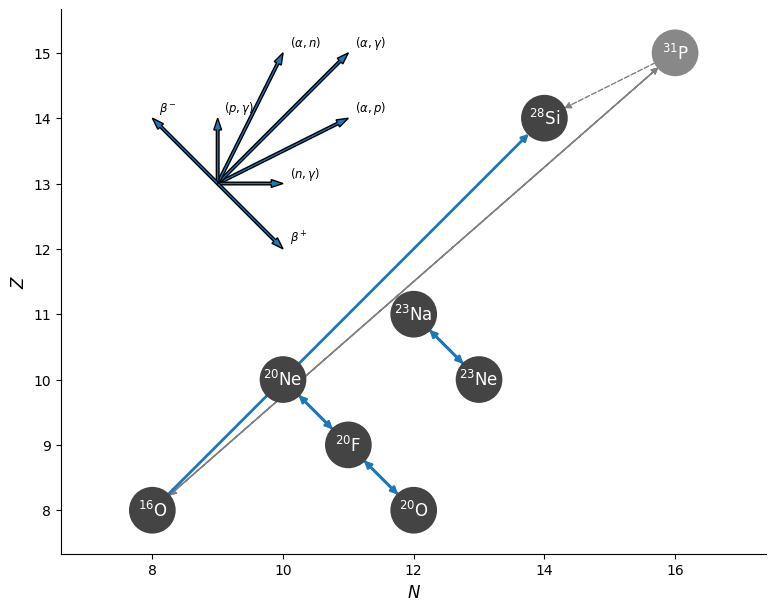
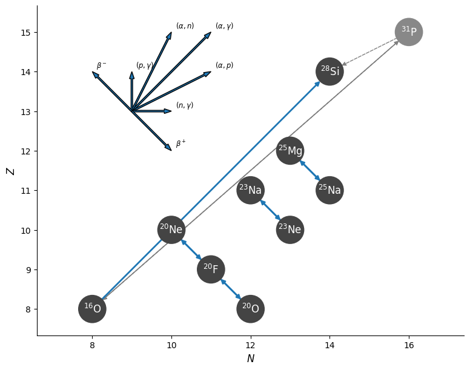

# Minilab 2: Getting in Debt

## Introduction

In Lab 1 you built a minimal nuclear network for an accreting ONe white dwarf and watched the core march toward oxygen ignition.
But there is important physics we left out: **the Urca process**.

In sufficiently degenerate matter, certain nuclei can undergo cyclic electron captures and beta decays at a specific **threshold density** — a so-called *Urca shell*.
The name comes from the Urca Casino in Rio de Janeiro: neutrinos carry energy out of the star as quickly as money vanishes at the tables.
Each cycle emits two neutrinos, providing a potentially significant cooling mechanism that is sensitive to the accretion rate.

In this lab you will:
1. Add the **A=23 Urca pair** (${^{23}\rm{Na}}$ ↔ ${^{23}\rm{Ne}}$) to your nuclear network and observe the Urca shell in real time with pgstar.
2. Add the **A=25 Urca pair** (${^{25}\rm{Mg}}$ → ${^{25}\rm{Na}}$ → ${^{25}\rm{Ne}}$) and compare its effect against the A=23 run using pgstar plots and terminal history output.
3. Estimate the **compressional heating and Urca cooling timescales** of the white dwarf.

The files for this lab can be found in the [Lab 2 Google Drive folder](https://drive.google.com/drive/folders/1AIM4g5PDbi5xV7wByY-F9xBA317evdMB?usp=drive_link) (starting point, partial solutions, and full solution).

Consult the [MESA documentation](https://docs.mesastar.org/en/latest/) throughout this lab.

---

## Part 1: Adding the A=23 Urca Pair (²³Na/²³Ne)

### Step 0: Start Up

| 📋 TASK 1 |
|:--------|
| **Download** the Lab 2 starting point from the [Google Drive](https://drive.google.com/file/d/1G-BdTQD5t76uFWeSdFA3hd-5cF0-bPxE/view?usp=sharing) and **unzip** it to a local working directory. |

The starting point is similar to your completed Lab 1 setup, but now configured to load a 1.1 M<sub>&#9737;</sub> O-Ne-Na white dwarf model.

After downloading, your working directory should look like:


  
    
    
    
    
    
    
    
    
    
    
    
    
      
    
      
      
    
  


> [!NOTE]
> `run_star_extras.f90` has been updated from Lab 1. It now computes the A=23 electron capture and beta decay rates ($\lambda_{\rm Na23 \to Ne23}$ and $\lambda_{\rm Ne23 \to Na23}$) as extra profile columns used by pgstar to show the Urca shell.

> [!TIP]
> After unzipping, verify your directory matches the listing above by running `ls` (Linux/Mac) or `dir` (Windows) in the working directory.


### Step 1: Build the ONeNa Network

A **nuclear network** defines which isotopes and reactions MESA tracks during a simulation.
By default, reactions not in the network are ignored even if they could occur at the conditions being modelled.
To study the A=23 Urca shell we need the network to know about $^{23}\mathrm{Na}$ and $^{23}\mathrm{Ne}$ and the weak reactions connecting them.

The starting network (`ONe.net`) contains the ²⁰Ne→²⁰F→²⁰O electron capture chain and ¹⁶O burning, but no ²³Na or ²³Ne.
To model the A=23 Urca pair we need to add both isotopes and their connecting weak reactions.

| 📋 TASK 2 |
|:--------|
| **Create a new file `ONeNa.net`** in your working directory. Starting from `ONe.net`, **add $^{23}\mathrm{Na}$, $^{23}\mathrm{Ne}$** and the two Urca reactions that connect them. |

> [!NOTE]
> MESA reaction names follow the pattern `r_<lhs>_wk_<rhs>` (electron capture) and `r_<lhs>_wk-minus_<rhs>` (beta decay). A full list of available weak reactions can be found under `$MESA_DIR/data/rates_data/weakreactions.tables`.

> [!NOTE]
> The A=23 Urca pair consists of:
> - Electron capture: $^{23}_{11}\mathrm{Na} + e^- \to {^{23}_{10}\mathrm{Ne}} + \nu_e$
> - Beta decay: $^{23}_{10}\mathrm{Ne} \to {^{23}_{11}\mathrm{Na}} + e^- + \bar{\nu}_e$

Visually this network look like:




Add to `add_isos(...)`:
- `na23`
- `ne23`

Add to `add_reactions(...)`:
- `r_na23_wk_ne23`  — electron capture Na23 + e⁻ → Ne23
- `r_ne23_wk-minus_na23` — beta decay Ne23 → Na23 + e⁻



```fortran
add_isos(
    h1
    he4
    o16
    ! for Ne20 - F20 - O20 electron capture chain
    ne20
    f20
    o20
    ! for A=23 Urca pair
    na23
    ne23
    ! for O ignition
    si28
    )

add_reactions(
    ! for oxygen ignition
    r1616
    ! for Ne20 - F20 - O20
    r_ne20_wk_f20
    r_f20_wk-minus_ne20
    r_f20_wk_o20
    r_o20_wk-minus_f20
    ! A=23 Urca pair: Na23 + e- <-> Ne23
    r_na23_wk_ne23
    r_ne23_wk-minus_na23
    )
```



### Step 2: Update the Inlists

With the network in hand, update the inlists to use it and include $^{23}\mathrm{Na}$ in the accreted material.

| 📋 TASK 3 |
|:--------|
| In `inlist_accrete`, **change the network** to `ONeNa.net` and **add Na²³** to the accreted composition. Use a mass fraction of 5% $^{23}\mathrm{Na}$ (reducing $^{20}\mathrm{Ne}$ from 50% to 45%). |


In `&star_job`:
- `new_net_name = 'ONeNa.net'`

In `&controls`, update the accretion block:
- `num_accretion_species = 3`
- Add `accretion_species_id(3) = 'na23'` and `accretion_species_xa(3) = 0.05d0`
- Adjust $^{20}\mathrm{Ne}$ fraction so that all fractions sum to 1.



```fortran
! in &star_job
    new_net_name = 'ONeNa.net'   !!!!!

! in &controls
    num_accretion_species = 3           !!!!!
    accretion_species_id(1) = 'o16'
    accretion_species_xa(1) = 0.50d0
    accretion_species_id(2) = 'ne20'
    accretion_species_xa(2) = 0.45d0   !!!!!
    accretion_species_id(3) = 'na23'   !!!!!
    accretion_species_xa(3) = 0.05d0   !!!!!
```


<!-- > [!WARNING]
> Remember to do `./clean && ./mk` after any change to a network file or `run_star_extras.f90`. -->


### Step 3: Run and Observe the A=23 Urca Shell

| 📋 TASK 4 |
|:--------|
| Compile and run with `./clean`, `./mk` then `./rn`. In the pgstar window labelled **"A=23 Urca Shell"**, observe the composition profile and the neutrino emissivity as the core density increases. |

You should see two windows open: the main grid overview (`Grid2`) and the Urca shell profile plot (`Profile_Panels1`).

In `Profile_Panels1`, look for:
- **Top panel** — the electron capture rate ($\lambda_{\rm Na23 \to Ne23}$) and beta decay rate ($\lambda_{\rm Ne23 \to Na23}$) as functions of $\log\rho$.
  The **Urca shell** is located where these two rates are equal ($\lambda_{\rm EC} = \lambda_{\rm BD}$), corresponding to the threshold density.
- **Bottom panel** — the neutrino emissivity (`eps_nuc_neu_total`, solid) and thermal neutrino emission (`non_nuc_neu`, dashed).
  A localised peak in the nuclear neutrino emissivity marks the active Urca shell.


> [!TIP]
> PNG snapshots of each pgstar frame are saved to `png/` inside your LOGS directory. If you miss a frame or want to compare later, check there.

> [!NOTE]
> At what log density does the A=23 Urca shell sit? You can compare this to the theoretical threshold:
> $$\log_{10} \rho_{\rm thresh} \approx 9.0 \quad (^{23}\mathrm{Na}/^{23}\mathrm{Ne})$$


The Urca shell only activates once the central density exceeds the threshold (~10⁹ g cm⁻³).
Be patient — it can take several hundred model steps for accretion to compress the core to this density.
Check `log_cntr_Rho` in the text summary to track progress.


> [!NOTE]
> If you want to see the final pgstar frame before MESA closes, you can add `pause_before_terminate = .true.` to the `&star_job` section of `inlist_common`.

---

## Part 2: Adding the A=25 Urca Pair (²⁵Mg/²⁵Na/²⁵Ne)

The A=25 Urca pairs operate at different threshold densities than A=23.
It consists of a two-step electron capture chain:
$$^{25}_{12}\mathrm{Mg} + e^- \to {^{25}_{11}\mathrm{Na}} + \nu_e \quad \text{then} \quad {^{25}_{11}\mathrm{Na}} + e^- \to {^{25}_{10}\mathrm{Ne}} + \nu_e$$
and the reverse beta decays.

Visually, this network appears as:



### Step 4: Build the ONeNaMg25 Network

ONeMg white dwarfs accrete material that includes $^{24}\mathrm{Mg}$ and $^{25}\mathrm{Mg}$ from their envelopes.
$^{25}\mathrm{Mg}$ undergoes a two-step electron capture chain at densities slightly above the A=23 Urca shell, making it the next natural Urca pair to add.
$^{24}\mathrm{Mg}$ does not have an Urca pair in this density range but is still accreted and should be tracked.

| 📋 TASK 5 |
|:--------|
| **Create a new file `ONeNaMg25.net`** by extending `ONeNa.net` to include the A=25 species and reactions. Also add $^{24}\mathrm{Mg}$ as a tracked species (it is accreted). |


Additional isotopes:
- `mg25`, `na25`, `ne25`
- `mg24` (tracked; no new Urca reactions needed for A=24 at this stage)

Additional reactions:
- `r_mg25_wk_na25`       — EC: Mg25 + e⁻ → Na25
- `r_na25_wk-minus_mg25` — BD: Na25 → Mg25 + e⁻
- `r_na25_wk_ne25`       — EC: Na25 + e⁻ → Ne25
- `r_ne25_wk-minus_na25` — BD: Ne25 → Na25 + e⁻



```fortran
add_isos(
    h1
    he4
    o16
    ne20
    f20
    o20
    ! A=23 Urca pair
    na23
    ne23
    ! A=25 Urca pair
    mg25
    na25
    ne25
    ! other accreted species
    mg24
    ! for O ignition
    si28
    )

add_reactions(
    r1616
    ! Ne20 - F20 - O20
    r_ne20_wk_f20
    r_f20_wk-minus_ne20
    r_f20_wk_o20
    r_o20_wk-minus_f20
    ! A=23 Urca pair
    r_na23_wk_ne23
    r_ne23_wk-minus_na23
    ! A=25 Urca pair
    r_mg25_wk_na25
    r_na25_wk-minus_mg25
    r_na25_wk_ne25
    r_ne25_wk-minus_na25
    )
```



### Step 5: Update the Inlists for the A=25 Run

> [!NOTE]
> The `1.1Msun_ONeMg2Na.mod` starting model is already included in your working directory.

| 📋 TASK 6 |
|:--------|
| Update `inlist_accrete` to use `ONeNaMg25.net`, load the `1.1Msun_ONeMg2Na.mod` starting model, set the LOGS directory to `LOGS_ONeNaMg25_1d-6`, and update the accretion composition to include ²⁴Mg (5%) and ²⁵Mg (1%). |

> [!NOTE]
> We want all accreted mass fractions to sum to 1. Adding Mg24 (5%) and Mg25 (1%) means reducing something else by 6%. We reduce $^{20}$Ne: it is the most abundant species in the mix, and because Ne ignites (via electron capture) at a higher density than O, its exact initial abundance matters less for the dynamics we are studying here. The true initial composition of an ONe white dwarf would need to be determined through full stellar evolution calculations.


```fortran
! in &star_job
    load_model_filename = '1.1Msun_ONeMg2Na.mod'                                !!!!!
    new_net_name = 'ONeNaMg25.net'                                !!!!!

! in &controls
    num_accretion_species = 5           !!!!!
    accretion_species_id(1) = 'o16'
    accretion_species_xa(1) = 0.50d0
    accretion_species_id(2) = 'ne20'
    accretion_species_xa(2) = 0.39d0   !!!!!  (reduced from 0.45 to make room for Mg24+Mg25)
    accretion_species_id(3) = 'na23'
    accretion_species_xa(3) = 0.05d0
    accretion_species_id(4) = 'mg24'   !!!!!
    accretion_species_xa(4) = 0.05d0   !!!!!
    accretion_species_id(5) = 'mg25'   !!!!!
    accretion_species_xa(5) = 0.01d0   !!!!!

    log_directory = 'LOGS_ONeNaMg25_1d-6'  !!!!!
```


| 📋 TASK 7 |
|:--------|
| In `src/run_star_extras.f90`, extend the rate computation to include the A=25 pair: change to **4 profile columns** and add the Mg25/Na25 species pair. Recompile with `./clean && ./mk`. |


In `how_many_extra_profile_columns`, change `2` to `4`.

In `data_for_extra_profile_columns`, extend `nr`, the column names, and the species pairs:
```fortran
! Change:
how_many_extra_profile_columns = 4

! In data_for_extra_profile_columns:
names(1) = 'lambda_na23_ne23'
names(2) = 'lambda_ne23_na23'
names(3) = 'lambda_mg25_na25'    ! A=25 EC: Mg25 + e- -> Na25
names(4) = 'lambda_na25_mg25'    ! A=25 BD: Na25 -> Mg25 + e-

nr = 4     ! was 2
! allocate(...) call stays the same — nr now controls the size

weak_lhs(1) = 'na23'; weak_rhs(1) = 'ne23'
weak_lhs(2) = 'ne23'; weak_rhs(2) = 'na23'
weak_lhs(3) = 'mg25'; weak_rhs(3) = 'na25'
weak_lhs(4) = 'na25'; weak_rhs(4) = 'mg25'
```


| 📋 TASK 8 |
|:--------|
| In `inlist_pgstar`, expand `Profile_Panels1` to **3 panels**: A=23 rates (panel 1), A=25 rates (panel 2), and the neutrino emissivity (panel 3). No recompile needed. |


Change `profile_panels1_num_panels = 2` to `3` and update the title.
Insert a new panel 2 block for the A=25 rates, and update the neutrino emissivity block from index `(2)` to `(3)`:
```fortran
profile_panels1_num_panels = 3
profile_panels1_title = 'Urca Shells'

! Panel 2: A=25 pair — Mg25 e-capture (left axis) vs Na25 beta-decay (right axis)
profile_panels1_yaxis_name(2) = 'lambda_mg25_na25'
profile_panels1_yaxis_log(2) = .true.
profile_panels1_ymin(2) = -40d0
profile_panels1_ymax(2) = 5d0
profile_panels1_other_yaxis_name(2) = 'lambda_na25_mg25'
profile_panels1_other_yaxis_log(2) = .true.
profile_panels1_other_ymin(2) = -40d0
profile_panels1_other_ymax(2) = 5d0

! Panel 3: neutrino emissivity — change all (2) indices below to (3)
profile_panels1_yaxis_name(3) = 'eps_nuc_neu_total'
profile_panels1_yaxis_log(3) = .true.
profile_panels1_ymin(3) = -5d0
profile_panels1_ymax(3) = 10d0
profile_panels1_other_yaxis_name(3) = 'non_nuc_neu'
profile_panels1_other_yaxis_log(3) = .true.
profile_panels1_other_ymin(3) = -5d0
profile_panels1_other_ymax(3) = 10d0
```



### Step 6: Run and Compare with pgstar

| 📋 TASK 9 |
|:--------|
| Run the A=25 case (`./rn`) and observe the **`Profile_Panels1`** window — it now shows three panels: A=23 rates (panel 1), A=25 rates (panel 2), and the combined neutrino emissivity (panel 3). |

Look for:
- A second Urca shell appearing at a **lower density** than the A=23 shell, and a third shell appearing at a higher density than the A=23 shell. 
- Any change in the neutrino emissivity profile — do the A=25 shells contribute noticeably?

> [!TIP]
> If you want to compare frames from the two runs side-by-side, check the `png/` subdirectory inside each LOGS directory. MESA saves a PNG of every pgstar frame there.

> [!NOTE]
> Theoretical threshold density for the A=25 shells:
> $$\log_{10} \rho_{\rm thresh} \approx 9.1 \quad (^{25}\mathrm{Mg}/^{25}\mathrm{Na})$$
> $$\log_{10} \rho_{\rm thresh} \approx 9.8 \quad (^{25}\mathrm{Na}/^{25}\mathrm{Ne})$$


### Step 7: Compare the Two Runs

| 📋 TASK 10 |
|:--------|
| Compare your A=23-only run against the A=23+A=25 run. Open the `png/` subdirectory inside each LOGS directory and compare the final pgstar frames side-by-side. Look at the central temperature and density evolution — does adding the second Urca pair produce a noticeable difference in the thermal history? |

Things to compare:
- Central temperature $T_c$ and density $\rho_c$ at the end of the run.
- Neutrino luminosity (`log_Lneu`) from your history file.
- The density at which the A=25 Urca shell becomes active compared to A=23.


The A=25 Urca pairs add new cooling shells, but since $^{25}\mathrm{Mg}$ makes up only 1% of the accreted material, their effect on the global thermal history is modest.
Both runs should track each other closely, with the A=23+25 run showing slightly enhanced neutrino luminosity near $\log\rho \approx 9.1$.
The dominant cooler for this composition is still the A=23 pair because Na23 is accreted at 5%.
This is a preview of the systematic survey you will carry out in Lab 3, where you will vary the composition to see how each Urca pair changes the ignition conditions.


---

## Bonus: Compressional Heating and Urca Cooling Timescales

> [!NOTE]
> For background on the physics in this bonus section, see Appendix A of [Schwab et al. 2017](https://arxiv.org/pdf/1708.07514).

As the white dwarf accretes mass, compressional work heats the core.
The Urca shells remove this energy via neutrinos.
The competition between these rates governs the thermal evolution and ultimately the ignition conditions.

Three timescales capture this competition:

| Symbol | Formula | Physical meaning |
|:-------|:--------|:----------------|
| $\tau_\rho$ | $\delta t \,/\, \lvert\delta \ln \rho_c\rvert$ | How long it takes to compress the core by $e$-fold |
| $\tau_\times$ | $(9/\eta)\,\tau_\rho$ | Time for the core to sweep through the Urca shell (shell width $\sim 9/\eta$ in $\ln\rho$) |
| $\tau_\nu$ | $c_v T \,/\, \epsilon_\nu$ | Thermal energy content divided by neutrino loss rate |

Here $\eta = \mu_e / k_B T$ is the electron degeneracy parameter and $\epsilon_\nu$ is the net neutrino energy loss rate per gram.
These timescales can be computed using variables stored in the `star_info` pointer `s` at each timestep.

### Bonus Step 1: Add timescale history columns

MESA lets you log custom quantities by implementing two functions in `run_star_extras.f90`:

- `how_many_extra_history_columns` — returns the number of extra columns
- `data_for_extra_history_columns` — fills in the column names and values

Open `src/run_star_extras.f90`. You will find both functions already stubbed out (the history counterparts of the profile lambda columns you added in Part 1). The stub looks like:

```fortran
integer function how_many_extra_history_columns(id)
   ...
   how_many_extra_history_columns = 0   ! !!!!! bonus: change to 3
end function how_many_extra_history_columns

subroutine data_for_extra_history_columns(id, n, names, vals, ierr)
   integer, intent(in) :: id, n
   character (len=maxlen_history_column_name) :: names(n)
   real(dp) :: vals(n)
   ...
   ! !!!!! bonus: fill in names and values here
end subroutine data_for_extra_history_columns
```

The three timescales require quantities evaluated at a single zone. We use zone index `s% nz`, which is the innermost zone (the stellar centre). All per-zone quantities in `star_info` are arrays indexed by zone; using `s% nz` picks out the central value:

| Field | Units | Quantity |
|:------|:------|:---------|
| `s% dt` | s | Current timestep |
| `s% dxh_lnd(s% nz)` | — | $\delta\ln\rho_c$ over this step |
| `s% eta(s% nz)` | — | Electron degeneracy parameter $\eta$ |
| `s% cv(s% nz)` | erg g⁻¹ K⁻¹ | Heat capacity at constant volume |
| `s% T(s% nz)` | K | Temperature |
| `s% eps_nuc_neu_total(s% nz)` | erg g⁻¹ s⁻¹ | Net neutrino energy loss rate |
| `secyer` | s yr⁻¹ | Seconds per year (from `const_def`, already `use`d) |

| 📋 BONUS TASK 1 |
|:--------|
| In `run_star_extras.f90`, change `how_many_extra_history_columns` to return **3**. Then populate `data_for_extra_history_columns` with **names and computed values** for `'tau_rho'`, `'tau_cross'`, and `'tau_cool'` (output in years). Recompile with `./mk`. |


```fortran
subroutine data_for_extra_history_columns(id, n, names, vals, ierr)
   ...
   real(dp) :: tau_rho, tau_cross, tau_cool

   names(1) = 'tau_rho'
   names(2) = 'tau_cross'
   names(3) = 'tau_cool'

   ! tau_rho: compressional timescale
   tau_rho = s% dt / max(abs(s% dxh_lnd(s% nz)), 1d-99)
   vals(1) = tau_rho / secyer

   ! tau_cross: time to sweep through the Urca shell
   tau_cross = 9d0 / max(s% eta(s% nz), 1d-10) * tau_rho
   vals(2) = tau_cross / secyer

   ! tau_cool: neutrino cooling timescale
   if (s% eps_nuc_neu_total(s% nz) > 0d0) then
      tau_cool = s% cv(s% nz) * s% T(s% nz) / s% eps_nuc_neu_total(s% nz)
   else
      tau_cool = 1d99
   end if
   vals(3) = min(tau_cool / secyer, 1d99)
```
The `max(...)` guards prevent division by zero during the early stages of a run.


### Bonus Step 2: Display the timescales in pgstar

MESA's `History_Panels` plot type can display any history column (including your new extras) against any other history column or model number.
Each panel has a left and right y-axis; set `yaxis_log = .true.` to display $\log_{10}$ of the value.

Add a `History_Panels1` block to `inlist_pgstar` that shows the three timescales vs $\log\rho_c$ — no recompile needed.

| 📋 BONUS TASK 2 |
|:--------|
| Add a `History_Panels1` window to `inlist_pgstar` with 2 panels: one comparing $\tau_\rho$ and $\tau_\nu$, another comparing $\tau_\times$ and $\tau_\nu$. Use `log_center_Rho` as the x-axis. Run with `./rn` and watch the timescales evolve. |


```fortran
  History_Panels1_win_flag = .true.
  History_Panels1_win_width = 10
  History_Panels1_title = 'Timescales'

  History_Panels1_xaxis_name = 'log_center_Rho'
  History_Panels1_xmin = 8.5d0
  History_Panels1_xmax = -101d0   ! -101 means auto

  History_Panels1_num_panels = 2

  ! Panel 1: compressional vs cooling
  History_Panels1_yaxis_name(1) = 'tau_rho'
  History_Panels1_yaxis_log(1) = .true.
  History_Panels1_ymin(1) = 0d0
  History_Panels1_ymax(1) = 15d0
  History_Panels1_other_yaxis_name(1) = 'tau_cool'
  History_Panels1_other_yaxis_log(1) = .true.
  History_Panels1_other_ymin(1) = 0d0
  History_Panels1_other_ymax(1) = 15d0

  ! Panel 2: crossing vs cooling
  History_Panels1_yaxis_name(2) = 'tau_cross'
  History_Panels1_yaxis_log(2) = .true.
  History_Panels1_ymin(2) = 0d0
  History_Panels1_ymax(2) = 15d0
  History_Panels1_other_yaxis_name(2) = 'tau_cool'
  History_Panels1_other_yaxis_log(2) = .true.
  History_Panels1_other_ymin(2) = 0d0
  History_Panels1_other_ymax(2) = 15d0
```


### Bonus Step 3: Interpret the results

| 📋 BONUS TASK 3 |
|:--------|
| Run with `./rn`. At late times ($\log\rho_c \gtrsim 9$), which timescale is shortest: $\tau_\rho$, $\tau_\times$, or $\tau_\nu$? What does the ordering imply for whether the Urca shells can efficiently regulate the core temperature? |


- If $\tau_\nu \ll \tau_\times$: the Urca shells cool the WD faster than compression heats it — the core temperature plummets.
- If $\tau_\times \ll \tau_\nu$: compressional heating wins and the WD warms up. 
<!-- - If $\tau_\times \ll \tau_\rho$: the core sweeps through the Urca shell quickly, so even a narrow shell can radiate efficiently. -->

This balance is sensitive to $\dot{M}$ and the Urca pair threshold densities — exactly the crowdsourcing question you will explore in Lab 3!


---

## Solution / End Point

The end-of-Part-2 solution for Lab 2 (which also serves as a starting point for Lab 3) can be downloaded [HERE](https://drive.google.com/file/d/1vlbxquOjileIJY7UogjK0uygmGJMzJjn/view?usp=sharing).

If you also completed the bonus section, the full bonus solution can be downloaded [HERE](https://drive.google.com/file/d/1LDzAf6e-YG44iHIwmgbG3UDjS5NDOTK9/view?usp=sharing).

[^1]: Suzuki et al. 2016, ApJ 817, 163 — sd-shell electron capture and β-decay rates at stellar densities.
